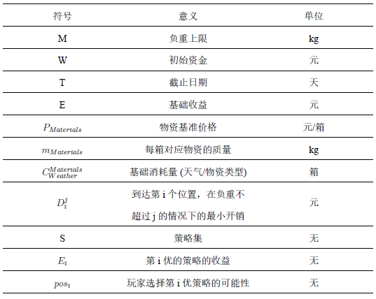
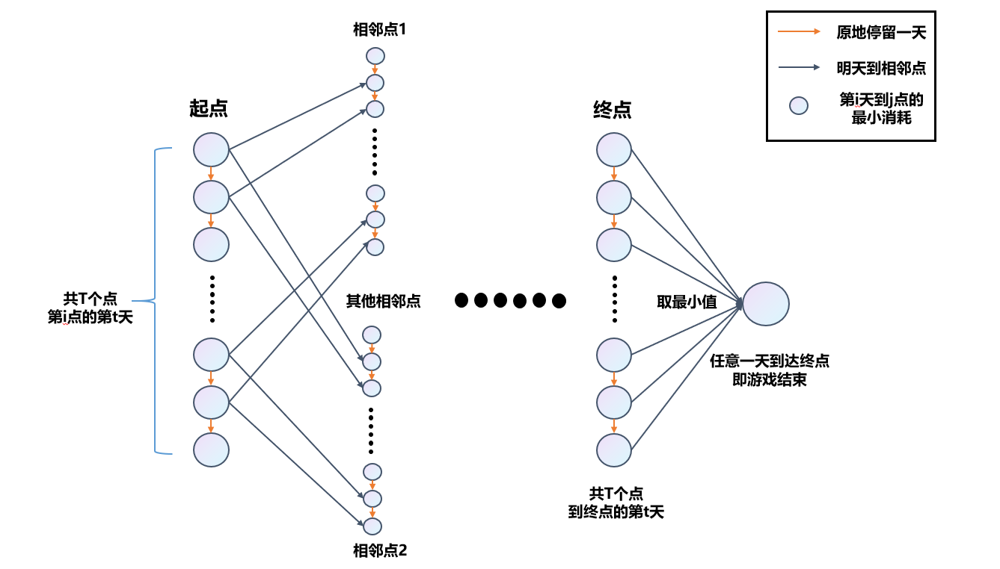
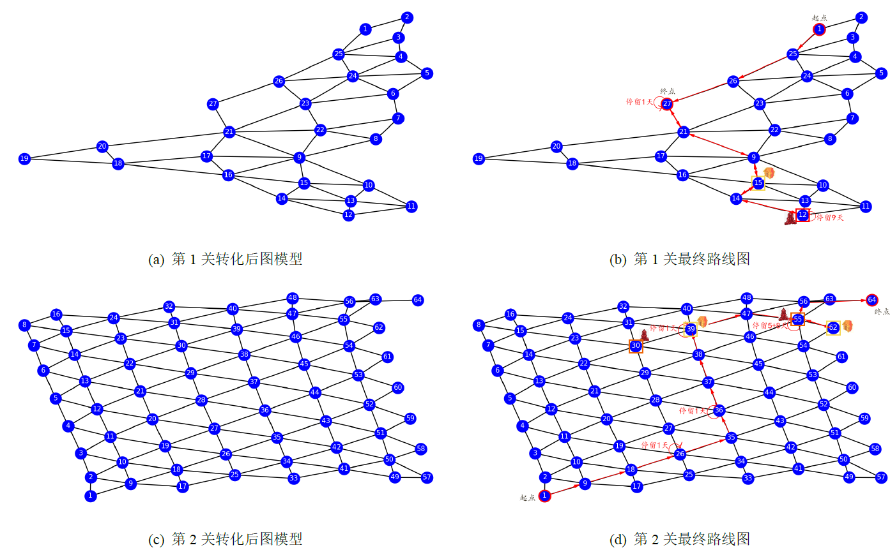
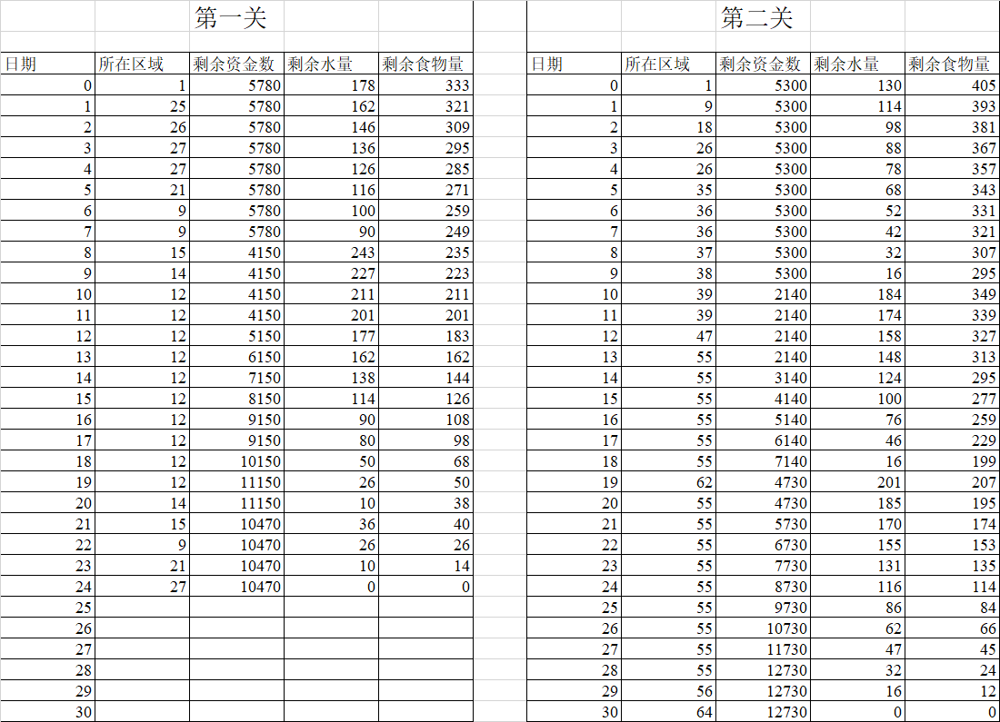
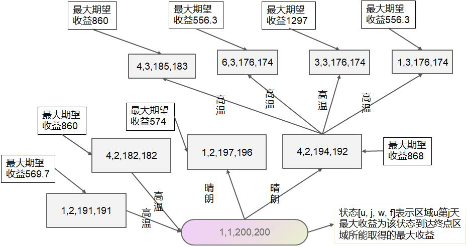
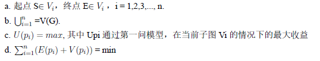
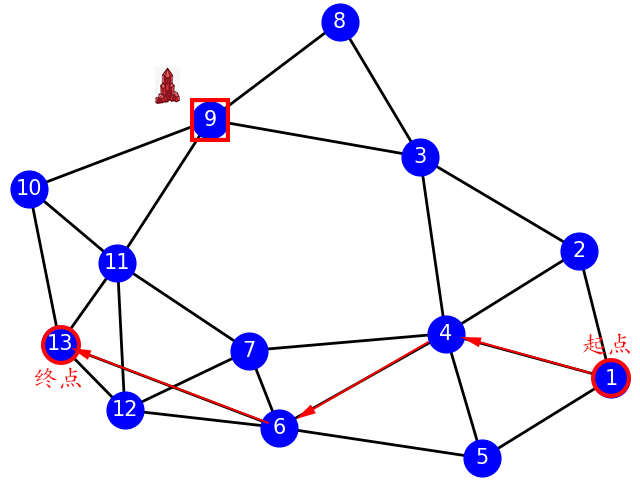
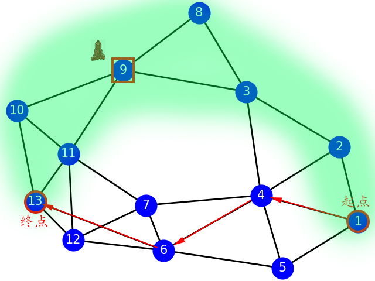
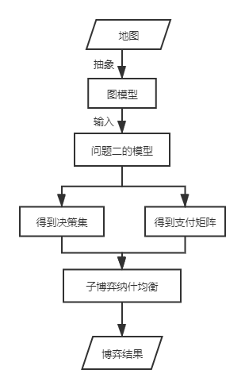
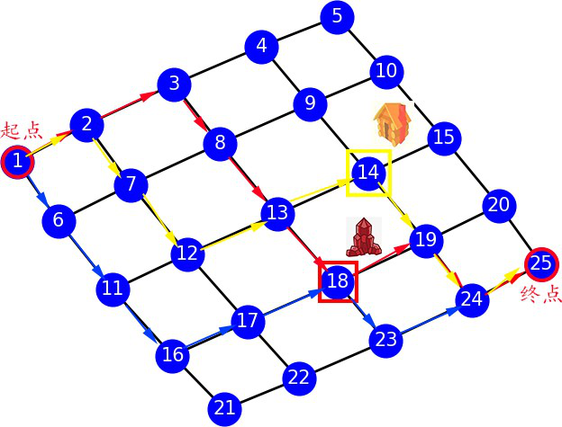

> 于2020年的9月份参加了全国大学生数学建模比赛，第二次参加建模比赛，主要负责论文撰写、模型的设计和验证。在团队中担任了一名相对划水的角色，参赛的时间段正值个人心态爆炸的阶段，导致状态不太靠谱，好在队友非常给力。B题是一道ACM中求最短路的题目，第一问是有标答的，估计后来进国赛也是因为第一问的答案正确，最终在及其神奇的一场答辩中获得了国家二等奖，也算是为我的建模生涯画上了一个比较不错的句号(当然也就参加了两场:smiley:)。

## 题目大意

考虑如下的小游戏：玩家凭借一张地图，利用初始资金购买一定数量的水和食物（包括食品和其他日常用品），从起点出发，在沙漠中行走。途中会遇到不同的天气，也可在矿山、村庄补充资金或资源，目标是在规定时间内到达终点，并保留尽可能多的资金。
游戏的基本规则如下：
（1）以天为基本时间单位，游戏的开始时间为第0天，玩家位于起点。玩家必须在截止日期或之前到达终点，到达终点后该玩家的游戏结束。
（2）穿越沙漠需水和食物两种资源，它们的最小计量单位均为箱。每天玩家拥有的水和食物质量之和不能超过负重上限。若未到达终点而水或食物已耗尽，视为游戏失败。
（3）每天的天气为“晴朗”、“高温”、“沙暴”三种状况之一，沙漠中所有区域的天气相同。
（4）每天玩家可从地图中的某个区域到达与之相邻的另一个区域，也可在原地停留。沙暴日必须在原地停留。
（5）玩家在原地停留一天消耗的资源数量称为基础消耗量，行走一天消耗的资源数量为基础消耗量的 倍。
（6）玩家第0天可在起点处用初始资金以基准价格购买水和食物。玩家可在起点停留或回到起点，但不能多次在起点购买资源。玩家到达终点后可退回剩余的水和食物，每箱退回价格为基准价格的一半。
（7）玩家在矿山停留时，可通过挖矿获得资金，挖矿一天获得的资金量称为基础收益。如果挖矿，消耗的资源数量为基础消耗量的 倍；如果不挖矿，消耗的资源数量为基础消耗量。到达矿山当天不能挖矿。沙暴日也可挖矿。
（8）玩家经过或在村庄停留时可用剩余的初始资金或挖矿获得的资金随时购买水和食物，每箱价格为基准价格的2倍。
请根据游戏的不同设定，建立数学模型，解决以下问题。

* 假设只有一名玩家，在整个游戏时段内每天天气状况事先全部已知，试给出一般情况下玩家的最优策略。求解附件中的“第一关”和“第二关”，并将相应结果分别填入Result.xlsx。

* 假设只有一名玩家，玩家仅知道当天的天气状况，可据此决定当天的行动方案，试给出一般情况下玩家的最佳策略，并对附件中的“第三关”和“第四关”进行具体讨论。

* 现有 名玩家，他们有相同的初始资金，且同时从起点出发。若某天其中的任意 名玩家均从区域A行走到区域B( )，则他们中的任一位消耗的资源数量均为基础消耗量的 倍；若某天其中的任意 名玩家在同一矿山挖矿，则他们中的任一位消耗的资源数量均为基础消耗量的 倍，且每名玩家一天可通过挖矿获得的资金是基础收益的 ；若某天其中的任意 名玩家在同一村庄购买资源，每箱价格均为基准价格的 倍。其他情况下消耗资源数量与资源价格与单人游戏相同。
  （1）假设在整个游戏时段内每天天气状况事先全部已知，每名玩家的行动方案需在第 天确定且此后不能更改。试给出一般情况下玩家应采取的策略，并对附件中的“第五关”进行具体讨论。
  （2）假设所有玩家仅知道当天的天气状况，从第 天起，每名玩家在当天行动结束后均知道其余玩家当天的行动方案和剩余的资源数量，随后确定各自第二天的行动方案。试给出一般情况下玩家应采取的策略，并对附件中的“第六关”进行具体讨论。

  注1：附件所给地图中，有公共边界的两个区域称为相邻，仅有公共顶点而没有公共边界的两个区域不视作相邻。
  注2：Result.xlsx中剩余资金数（剩余水量、剩余食物量）指当日所需资源全部消耗完毕后的资金数（水量、食物量）。若当日还有购买行为，则指完成购买后的资金数（水量、食物量）。

## 题目解答

第一二问的核心是建立一个最短路模型，当然在后面和夏大佬的讨论中，我们得知建图的方法不唯一，所谓条条大路通罗马嘛。我甚至怀疑在四川赛区的国赛答辩中，有人是通过非常玄学的方式手算进的答辩，而这只是个人推测嘛，事实如何也并不重要。然后题目的第三问是一道非常扯的题目，很多人都初步了解过博弈这个知识点，但是我们通常了解的都是双人博弈，在过去的ACM训练中，我感觉这是很难弄懂的一个板块，会涉及到一定的数学推导。但事实上第三问并非双人博弈，而是多人博弈模型，所以...

我们在搜集了大量的资料后，对第三问的解法还是一知半解，于是最终采用了相对比较合理的多人博弈模型，但是也仅供大家参考。

### 摘要

考虑如下的小游戏:玩家凭借一张地图，利用初始资金购买一定数量的水和食物 (包括食品和其他日常用品)，从起点出发，在沙漠中行走，途中会遇到不同的天气，也 可在矿山、村庄补充资金或资源，目标是在规定时间内到达终点，并保留尽可能多的资金。

本文主要尝试建立一种在算法和逻辑层面都优化的最短路算法(OLBA模型)，在此 基础上进行适当的改进已应对各种不同的参数设定情况，给出了附件excel 表格的解决方案。同时使用了博弈论来求解第三题中的两个问题，根据实际题目的情况，给出了一般情况下玩家应采取的策略。

对问题一，建立了OLBA模型并使用了带队列优化的BellmanFord模型求最短路， 对图进行了预处理缩点，将最短路直接连边，并且抽象地将时间信息和地点信息作为建图的节点，利用了数学模型得出了一些不可能的连边情况，从而进行模型剪枝，在辅助结论的推导下，对模型的情况进行了优化。该模型适用于所有可能情况，鲁棒性强，最后用附件中的样例来验证模型是否正确。第1关最优路径结论:在起点购买178 箱水和 333 箱食物，走如图2的路线到终点资金数最大，为10470。第2关最优路径结论:在起点购买130 箱水和405箱食物，走如图2的路线到终点资金数最大，为12730。

对问题二，基于第一问建立的OLBA模型进行改进， 将每个连接分成三种天气进行讨论，对边权进行更新和推导，输出任意区域的任意天数下的最大期望收益，从而给出一般情况下的最优决策，得到最终模型(W-OLBA模型)这是一种合理的一种改进模型，核心是求策略集合中期望收益最大的状态，该状态即为玩家的最佳策略下的选择， 具体情况需要具体分析。

对问题三，针对第一问建立了基于改进的OLBA和混合博弈模型的多玩家同策略集模型(MCSM模型)，使用收益相等法计算纳什均衡，为了避免非最优策略和最优策略 有过多的重复路径，将原始图模型G划分成了n个子图 最终在一般情况下玩家应该选择本文图5所展示的A或者C策略的任意一条。针对第二问建立了多阶段纳什均衡和子博弈完美均衡的博弈模型(MNSE模型)，基于W-OLBA模型在利用逆向归纳法求解子博弈纳什均衡的过程中，从动态博弈的最后一个阶段或最后一个子博弈开始，逐步向前倒推，从而达到求解动态博弈均衡的目的。

### 符号说明

### 第一题求解

题目要求假设只有一名玩家，在整个游戏时段内每天天气状况事先全部已知，试给出一般情况下玩家的最优策略。求解附件中的“第一关”和“第二关”，并将相应结果分别填入 Result.xlsx。

由于我们要给出一般情况下玩家的最优策略，所以第一问的思路是先建立数学模型，最后用附件中的样例来验证答案是否正确。我们根据参数设定、天气状况和地图综合考虑到达终点的所有情况，这里便涉及到了非常多的问题，是否去村庄，是否去矿山， 是否停留。当然如果仅仅从第一关和第二关给出的数据去讨论到达终点的情况是非常片面而且麻烦的。所以我们首先想到基于动态规划模型 (DP 模型) 来思考这道题的结题思路，这样我们的目标终点就不仅仅是某个点，而是一般情况的所有点，同时可以根据不同的参数设定、天气状况和地图去改变 DP 的过程，符合题目要求。

我们考虑状态的定义，就是最终 DP 的过程量，我们发现第一问影响到结论的不仅仅是到达终点的位置，同样也有负重上限 (水的限制、食物的限制) 和时间上限，因为在保持到某个点的最大收益的同时也要保证负重上限和时间上限没有被超过。如果将这四个数组都搜索一遍，这道题的时间复杂度将达到 O($TnM_{water}M_{food}log(TnM_{water}M_{food})$)， 我们假设普通计算机一秒运算$10^{8}$左右次，在这个复杂度的限制下，我们所能处理的最大的数据规模将被限制在  $TnM_{water}M_{food}$的乘积在$5\times10^{5}$个数据以内，仅仅处理这道题的所有问题显然足够，但是并非最优，所有我们考虑优化这个时间复杂度。于是我们对图的数据进行了预处理缩点，将最短路直接连边。

由于题目中的第四个条件规定了每天玩家可从地图中的某个区域到达与之相邻的另一个区域，也可在原地停留。不难看出这是一个建图的过程，我们将位置信息和时间信息作为图的节点加入图 中，然后设动态规划过程量以位置和负重上限作为标记，而这个数组的值，便是在某个负重上限的限制里到某一节点的最大收益，即:

d[i] [j] [k]= 在水和食物的箱数分别至少备 j 箱和 k 箱的情况下，从起点到第 i 个点的最小花销。

有向图模型得出后，转化这道题的题意，将核心从在规定时间内到达终点，并保留尽可能多的资金，转化为在规定时间内到达终点，并尽可能减少花销。这道题将转化为求最短路，我们采用队列优化带限制的 BellmanFord 算法。我们将所有的目标终点的但不同时间的节点都连到一个最终节点，我们求得最短路就是将出发点的第 0 天作为起点，将刚刚提到的最终节点作为终点，求得的一个最短路径，每个边权就是这一天的花销(可能为负)。同时由于在终点卖出食物和水的价格是原价的一半，所以我们优化模型在最后达到终点后的水和食物剩余量为 0。

建图规则：

* 每条边保存三个值，分别为边的权值、消耗的水的箱数、消耗的食物的箱数。
* 连节点的方法，边的种类有三种，分别为相同区域相邻天数节点之间的连边（原地停留）、相邻区域相邻天数节点的连边、挖矿连边。其中相同区域相邻天数节点的连边的权值为 0，消耗的水和食物的箱数为基础消耗，相邻区域相邻天数节点的连边的权值为 0，消耗的水和食物为基础消耗的 2 倍，挖矿连边的权值为基础工资，消耗的水和食物的箱数为基础消耗的 3 倍，相邻区域由当前节点 (第 i 个位置，第 j 天) 可以到达相邻点节点 (相邻点的位置，第 j+1 天) 或者原地停留到 (第 i 个位置，第 j+1 天)。
* 初始位置为起点的第 0 天。如果不能走到终点，那么最终节点的最小花销值将是INF(无穷大)，如果能走到终点，终点的每一天与最终节点相连，取$D^{i}_{destination}$  ( $1\leq i \leq T$)。

OLBA 模型伪代码如下:

 

------

输入：地图数据、天气数据、水和食物的基础消耗数据、初始资金与基础收益数据变量：

n， m 区域以及相邻区域关系的数目

K：负重上限

Init S: 初始资金

DDL：截止日期

Income： 基础收入 

Water：一箱水的重量和价格

Food：一箱食物的重量和价格

Consume[3] [2]：不同天气下水和食物的消耗量，其中 0 代表晴朗，1 代表高温，2 代表沙暴

Weather[DDL]： 当前天气       

Mine[n]：区域的类别，其中 1 代表矿山，2 代表村庄

D[i] [j] [k]：代表状态 i 下拥有 j 箱水和 k 箱食物所能取得的最大利益

输出：最优路线

------

带限制的 BellmanFord

------

算法：

初始化：将 d 初始化为正无穷大，d 值代表状态 i 下拥有 j 箱水和 k 箱食物所能取得的最大利益。

------

建图：

------

顶点：将一个区域拆分成 DDL+1 个点，DDL 为截止天数，即每一个顶点（i， j）代表着区域 i 第 j 天。

边：存储 3 个值，分别为权值 val（权值为从上一个状态到当前状态所需的花费，其中只有挖矿边有权值，其余为 0）、从上一个状态到下一个状态所消耗的水的箱数 W、从上一个状态到下一个状态所消耗的食物的箱数 F。

建边规则：

同一区域相邻天数顶点之间的边：权值为 0，消耗的水和食物箱数为基础消耗。

矿山顶点直接按挖矿事件的边：权值为基础收入，消耗的水和食物箱数为基础消耗的 2

倍。

相邻区域相邻天数顶点（同时天气不为沙暴）之间的边：权值为 0，消耗的水和食物箱数为基础消耗的 3 倍。

* 步骤一：队列中保存状态（u，j，w，f），其中 u 为区域，j 为日期天数，w，f 该状态下拥有的水和食物。（由于本小题天气情况已知，因此到达终点后剩余的水和食物的箱数都为 0 的状态下取得最优解），将状态（T，j，0，0，0）放进队列中，其中 T 为终点区域，j 为日期天数。
* 步骤二：

1. 从队列中取出顶点 x。

2. 判断该状态是否为属于起点区域中的第一天，如果是，更新答案ans = max(ans， 该状态的 d 值减去水和食物的价格)。

3. 判断该顶点是否为村庄区域，如果是，根据购买事件对购买完一个水箱或者食物箱后的 d 值，更新规则如下：

（1） 购买一个水箱，如果在 w-1 个水箱和f 个食物箱的d 值大于在w 个水箱和f 个食物箱的d 值加上水的价格，则更新在 w-1 个水箱和f 个食物箱的d 值，如果该状态不在队列中，则将其加入队列。

（2） 购买一个食物箱，如果在w 个水箱和 f-1 个食物箱的d 值大于在w 个水箱和f 个食物箱的d 值加上食物的价格，则更新在w 个水箱和 f-1 个食物箱的d 值，如果该状态不在队列中，则将其加入队列。

4. 更新同一区域相邻天数和相邻区域相邻天数的 d 值，如果同一区域相邻天数的 d 值或相邻区域相邻天数的d 值大于在当前状态下d 值加上两者之间边的权值，则更新同一区域相邻天数的d 值或相邻区域相邻天数的d 值，如果该状态不在队列中，则将其加入队列。

* 步骤三：重复步骤二，直至优先队列为空。
* 步骤四：输出最优路线

------

我们使用c++ 代码，在使用了队列优化带限制的BellmanFord 算法，后我们得出了每天的一个行动轨迹和最终的金额。第 1 关和第 2 关的路线图如下:

具体每一步的资金消耗图如下:

 
图. 第一二关的过程图

最终的结论是，如图所示，结合 Result.xls 中表格。

玩家在第一关的最优方案可表述为：

玩家在起点购买 178 箱水和 333 箱食物，从此处出发，第 13 天依次走到区域 25、24、23，第 4 天停留在 23 区域，第 5、6 天依次走到区域 22、9；第 7 天在区域 9 停留后，第 8 天走到区域 15，即村庄，在此购买 163 箱水；第 9、10 天依次走到区域 14、12，然后第 11 天开始在区域 12 挖矿；连续挖矿 9 天后，第 20 天离开矿区进入区域 14，然后走到村庄（区域 15），并购买 36 箱水和 40 箱食物，以满足行程最后三天所需；第 22天从村庄走到区域 9，途径区域 21，在第 24 天抵达终点（即区域 27）。

此时剩余资金数最大，为 10470，没有剩余的水和食物。

第二关的最优方案表示为：

玩家在起点购买 130 箱水和 405 箱食物，依次经过区域 9/10/19/20/28/30，到达村庄1（即区域 39），玩家在此处购买 168 箱水和 54 箱食物，然后途径区域 47 到达矿区 1（区域 55）挖矿；从第 14 天（到达矿区我的第二天）开始，连续挖矿 5 天，然后去村庄2（区域 62）购买 185 箱水和 8 箱食物，然后回到矿区 1（区域 55）挖矿 8 天；在第 29 天的时候，离开矿区 1（区域 55），经区域 56 到达终点（区域 64）。

到达终点时剩余资金数为 12730，无剩余的水和食物。

### 第二题求解

W-OLBA 模型伪代码如下:

------

输入：地图数据、天气数据、水和食物的基础消耗数据、初始资金与基础收益数据变量：

n， m 区域以及相邻区域关系的数目

K：负重上限

Init S: 初始资金

DDL：截止日期

Income：基础收入

Water：一箱水的重量和价格

Food：一箱食物的重量和价格

Consume[3] [2]：不同天气下水和食物的消耗量，其中 0 代表晴朗，1 代表高温，2 代表沙暴 

Mine[n]：区域的类别，其中 1 代表矿山，2 代表村庄

D[i] [j] [k]：代表状态 i 下拥有 j 箱水和 k 箱食物所能取得的最大期望利益

Dp[i] [j] [k] [t]：代表该状态 i 下拥有 j 箱水和 k 箱食物在天气 t 下所能取得的最大期望收益

输出：输出任意区域的任意天数下的最大期望收益

------

概率 DP 算法：

------

初始化：将 d 初始化为正无穷大，d 值代表状态 i 下拥有 j 箱水和 k 箱食物所能取得的最大利益。

------

建图：

------

顶点：将一个区域拆分成 DDL+1 个点，DDL 为截止天数，即每一个顶点（i， j）代表着区域 i 第 j 天。

边：权值为从上一个状态到当前状态所需的花费。

* 步骤一：

队列中保存状态（u，j，w，f），其中 u 为区域，j 为日期天数，w，f 该状态下拥有的水和食物。将状态（T，j，w，f）放进优先队列中，其中 T 为终点区域，j 为任意天数，w， f 为任意满足条件的值，同时更新该状态下的 d 值。

* 步骤二：

1. 从队列中取出顶点 x。

2. 判断该顶点是否为村庄区域，如果是，根据购买事件对购买完一个水箱或者食物箱后的 d 值，更新规则如下：

（1） 购买一个水箱，如果在 w-1 个水箱和f 个食物箱的d 值大于在w 个水箱和f 个食物箱的d 值加上水的价格，则更新在 w-1 个水箱和f 个食物箱的d 值，如果该状态不在队列中，则将其加入队列。

（2） 购买一个食物箱，如果在w 个水箱和 f-1 个食物箱的d 值大于在w 个水箱和f 个食物箱的d 值加上食物的价格，则更新在w 个水箱和 f-1 个食物箱的d 值，如果该状态不在队列中，则将其加入队列。

3. 更新同一区域相邻天数和相邻区域相邻天数的 dp 值:

每个连接分成三种天气进行讨论：

在不同天气下，在天气k 和当前状态推断出上一个状态的水箱数w 以及食物箱数f，如果上一个状态在天气 k 的 dp 值大于在当前状态下 d 值加上两者之间边的权值，则更新上一个状态在天气 k 下的 dp 值。

如果上一个状态的所有天气情况都已经计算过，则上一个状态的 d 值为三种天气情况下的 dp 值的均值，如果该状态不在队列中，则将其加入队列

* 步骤三：重复步骤二，直至优先队列为空。

* 步骤四：输出任意区域的任意天数下的最大期望收益

------

 状态 [i，j，w，f] 代表区域 i 第 j 天玩家拥有的水的箱数 w 以及食物箱数 f，d 值代表该状态下的最大期望收益。

首先根据算法 2 计算出所有的 d 值，然后进行决策，决策过程如下：

找出该状态下的所有相邻状态集合，然后找出集合中 d 值最大的状态，该状态即为玩家的最佳策略下的选择。

 
图. 第3关动态决策示例

本文在第三关中共取出来 4 个状态观察其相邻状态的取值，并给出在该状态下的最优策略。

1. 状态[1，1，200，200] 在晴朗天气的情况下有相邻状态为[4，2，194，192]，[1，2，197，196]，其d 值分别为 [868.00，574.00]， 因此在该状态下最佳策略的选择为状态 [4，2，194，192]； 

2. 状态[3，5，200，200] 在高温天气的情况下有相邻状态为[9，6，182，182]，[4，6，182，182]，[3，6，191，191] 其d 值分别为 [1971.00，860.00，1310.67]， 因此在该状态下最佳策略的选择为状态 [9，6，182，182]；

3. 状态[6，15，200，200] 在高温天气的情况下有相邻状态为[13，16，182，182]，[4，16，182，182]，其d 值分别为[860.00，860.00，569.66]， 因此在该状态下最佳策略的选择为状态[13，16，182，182]或 [4，16，182，182]；

4. 状态[9，20，200，200] 在晴朗天气的情况下有相邻状态为[11，21，194，192]，[3，21，194，192]， [9，21，191，188] 其d 值分别为 [1282.33，1282.33，1948.67]， 因此在该状态下最佳策略的选择为状态 [9，21，191，188]；

本文在第四关中共取出来 5 个状态观察其相邻状态的取值，并给出在该状态下的最优策略。

1. 状态 [1，1，150，200] 在晴朗天气的情况下有相邻状态为 [6，2，144，192]，[1，2，147，196]，其 d 值分别为 [324.67， 193.33]， 因此在该状态下最佳策略的选择为状态 [6，2，144，192]；

2. 状态 [7，5，200，200] 在高温天气的情况下有相邻状态为 [8，6，182，182]，[6，6，182，182]，[7，6，191，191] 其d 值分别为 [362.33，362.33，237.67]， 因此在该状态下最佳策略的选择为状态 [8，6，182，182] 或 [6，6，182，182]；

3. 状态[14，10，200，200] 在沙暴天气的情况下有相邻状态为[19，11，180，180]，[9，11，180，180]，[14，11，190，190] 其d 值分别为 [1298.67， 558.00， 863.00]， 因此在该状态下最佳策略的选择为状态 [19，11，180，180]；

4. 状态[18，15，200，200] 在高温天气的情况下有相邻状态为[19，16，182，182]，[17，16，182，182]， [18，16，173，173] 其 d 值分别为 [1297.67，1297.67，1954.00]， 因此在该状态下最佳策略的选择为状态 [18，16，173，173]；

5. 状态[20，20，200，200] 在晴朗天气的情况下有相邻状态为[25，21，194，192]，[19，21，194，192]，其d 值分别为[515.67，1256.33，811.67]， 因此在该状态下最佳策略的选择为状态[19，21，194，192]；

### 第三题求解

#### 第三题第一问求解

题目给定了新的多人掘金游戏模型，假设在整个游戏时段内每天天气状况事先全部已知，每名玩家的行动方案在第 0 天确定且此后不能更改。我们了给出一般情况下玩家应采取的策略，并对附件中的“第五关”进行了具体讨论。

该问基于改进的 OLBA 和混合博弈模型（完全信息的静态博弈），建立了多玩家同策略集模型 (MNSM 模型)。

在这种情况下可以视每位玩家都有心中的一个最优策略，那么当多人参加这个游戏时，就涉及到了相互之间的博弈。参加斗争或竞争的各方各自具有不同的目标和利益。为了达到各自的目标和利益，各方必须考虑对手的各种可能的行动方案，并力图选取对自己最为有利或最为合理的方案。博弈论就是研究对策行为中斗争各方是否存在着最合理的行动方案，以及如何找到这个合理的行动方案的数学理论和方法。同时由于所有信息都给定，这可以看作完全信息博弈。

我们确定了本问中博弈论的三大要素：

(1). 局中人数: 根据题目要求，玩家人数为 n。

(2). 策略集: 本题的策略集采用第一问的 OLBA 模型，策略集中的最优策略就是第一问中” 一般情况下玩家的最优策略”，其他策略建立在最优策略存在的基础上，将会有次优策略、第三优策略等等，每一个新的最优策略建立在已经加入策略集的策略之上， 我们一步步挑选这些策略加入策略集，直到当一个策略满足: 该策略的收益$E_{cur}$小于等于直接从起点走带限制的最短路径到达终点的收益$E_{direct}$。此时如果再将操作继续下去将没有实际意义，故可以不考虑，对算法进行剪枝。将直接从起点走带限制的最短路径到达终点的策略也加入策略集，当前策略集中便是最终的本问所要使用的策略集S。设策略集的个数为 m，玩家 i 的有限纯策略集合可视作：
$$
S_{i}=s_{i 1}, s_{i 2}, \cdots, s_{i m}
$$
为了避免次优策略等非最优策略和最优策略有过多的重复路径，我们需要对原始图模型G 进行划分，即求图G 中顶点集V 的划分 V1， V2， ...， Vn，将 G 分成n 个生成子图G[V1]， G[V2]， ...，G[Vn]， 使得：

(3). 支付函数: 由于是多人的博弈，求支付函数的过程，也就是求纳什均衡的过程。支付函数由每个玩家的收益期望根据纳什均衡决定，故首先我们需要定义玩家 p 做决策i 的收益 Upi。

该收益 Upi 由两大部分组成：

a. 基础收益：在只有一个玩家的情况下，玩家 p 做决策 i 的最后剩余资金量 Bpi

b. 综合损耗：在其他玩家的影响下所减少的资金。该损耗由两大影响因素决定：

* 选择该决策 i 的玩家人数 K（假设选择决策 i 的人数为 Ki）
* 其他决策 j 对该决策的固有损耗以及选择决策 j 的玩家人数 Kj

对于本问，我们首先需要得出策略集。纯策略纳什均衡是指在一个纯策略组合中， 如果给定其他的策略不变，该节点不会单方面改变自己的策略，否则不会使节点访问代价变小。由于策略集可能会比较大，使用纯策略纳什均衡会难以选出最优策略，这时我们考虑加入混合策略纳什均衡博弈的模型。混合策略纳什均衡是面对其他博弈者选择的不确定性的一个理性对策，其主要特征是作为混合策略一部分的每一个纯策略有相同的期望值，否则，一个博弈者会选择那个期望值最高的策略而排除所有其他策略，这意味着原初的状态不是一个均衡。我们设定游戏中每个人都会选择混合策略来考虑自己一开始的路线。

我们将采用收益相等法，来计算纳什均衡，在得出概率情况之后，由于要给出一般情况下的最优策略，我们需要去具体去衡量每个人选择不同策略的概率，我们通过收益来权衡每个人选择不同策略的概率。将每个人选择不同策略的概率与纳什均衡得出的概率比较，得出一般情况下的最优决策模型。

在上述模型建立的基础上，我们对附件中的“第五关”进行具体求解：

（1） 确定局中人数 n=2。

（2） 根据第一问 OLBA 模型确定策略集。

首先加入的是最优策略，第 5 关最优策略如图:

根据第一问的 OLBA 模型确定最优解为 1->4->6->13，最后收益为 9535。如图所示，按模型中的四个约束对图进行划分：

在子图（图中阴影部分）得出的最优解为：1->2->3->9->10->13，最后收益为 9325。即策略 A 的收益为 9539，策略 B 的收益为 9325，按上述方法，以此类推，得出： 策略 C：1->5->6->13，收益为 9535

（3） 计算支付矩阵

上述收益均为基础收益，还需按照上述公式计算最终收益：

|      |       A        |       B        |       C        |
| :--: | :------------: | :------------: | :------------: |
|  A   | (8140 ，8140 ) | (9535 ，9525 ) | (9370， 9370 ) |
|  B   | (9535 ，9525 ) | (6400 ，6400 ) | (9535 ，9525 ) |
|  C   | (9370， 9370 ) | (9535 ，9525 ) | (8140 ，8140 ) |

         

 
图. 第5关模型和路线结果

玩家 1（行）选择 A 的概率为 p1，选择 B 的概率为 p2，选择 C 的概率为 p3；
$$
p1 + p2 + p3 = 1
$$
玩家 2（列）选择 A 的概率为 s1，选择 B 的概率为 s2，选择 C 的概率为 s3;
$$
s1 + s2 + s3 = 1
$$
玩家 1 选择 A 的期望收益等于玩家 1 选择 B 的期望收益等于玩家 1 选择 C 的期望收益，玩家 2 同理。

利用LINGO 求解得到玩家 1 选择A 策略的概率p1 = 0.4012，p2 = 0.1977，p3=0.4012， 期望收益为 8910.402。

玩家 2 选择 A 策略的概率 s1=0.4404，s2=1992，s3=0.4404;

从博弈论的角度来看，两名玩家均选择策略 A 或均选择策略 C 对自己一方的效益最大；题目要求给出一般情况下玩家应采取的策略，由于 A，C 策略期望和概率是相同的，并且都是最大的，那么该名玩家可以选择 A 或者 C。

但从团体最优的角度来看，为了使整体利益最大，应该一名玩家选择A，一名玩家选择 B

#### 第三题第二问求解

本问规定所有玩家仅知道当天的天气状况，从第天起，每名玩家在当天行动结束后均知道其余玩家当天的行动方案和剩余的资源数量，随后确定各自第二天的行动方案。试给出一般情况下玩家应采取的策略，并对附件中的“第六关”进行具体讨论。

本问在第二问所建立的模型基础上，建立多阶段博弈模型，多阶段博弈扩展形也称为“博弈树”。动态博弈各个博弈方的选择行为有先后次序，多阶段博弈第一个行动选择对应的决策节称为初始节，多阶段博弈一个选择节点所包含的所有信息叫做“信息集”。各博弈方的选择行为会依次形成相连的博弈阶段，因此动态博弈中博弈方的一次选禅行为常称为一个“阶段”。一个动态博弈至少有两个阶段. 因此动态博弃有时也称为“多阶段博弈”。此外. 也有称动态博弈为“序贯博弈”的，多阶段博弈多阶段博弈序贯博弈是指博弈方选择策略有时间先后的博弈形式。同矩阵表示法相比扩展式所扩展的主要是博弈方的策略空间，多阶段博弈即某个博弈方在什么时候行动，多阶段博弈行动时有哪些策略可以选择，以及知道哪些关于博弈的信息在多阶段博弈模型中，当局中人的策略在每一个子博弈中都构成纳什均衡时，则形成“子博弈精炼纳什均衡”。

因此，问题简化为求解每一步博弈的纳什均衡。对于每一步博弈的纳什均衡，我们采用第三题第一问的方法，即依次确定决策集、支付函数。

在求解问题二所建立的模型中，我们为了得到最优方案，需要计算玩家在每一步距离终点的效益期望，然后选择效益期望最大的作为下一步的策略选择。因此，在本问中， 我们利用问题二所建立的模型中所得到的“每一步的效益期望”，作为子博弈过程中的效益矩阵中的元素，进而求解每一步的纳什均衡。具体步骤如下：

（1） 利用问题二的模型求解该图模型“每一步的效益期望”

（2） 将每一步的效益期望作为该步博弈中的支付矩阵，求解其纳什均衡（求解方法同问题二第一问）

（3） 重复（2）的过程，求解每一步博弈的纳什均衡，直到归纳到第一个阶段的博弈

输出最后的博弈结果流程图如下：

     

图. 多阶段博弈流程图

（1）由于第六关和第四关的地图完全一致，故第六关基于(1)(2)问所建立的图模型以及求解该图模型所得到的结果，即“每一步的效益期望”求解。

（2）在第二问我们所得到的结果中，最后一个状态为 [20,20,200,200]，即玩家在第 20 天到达区域20 所拥有的水的箱数为 200，所拥有的食物的箱数为 200，该状态下所有状态的集合为 [25,21,194,192],[19,21,194,192],[20,21,197,196] 该集合中元素的期望效益所构成的元

组为 [515.67,1256.33,811.67]。在第二问中，我们选择最大期望收益作为策略。但在此问中，我们考虑的是一个动态博弈过程，因此我们将这些期望收益作为玩家的支付矩阵中的对应策略集。

得到效益矩阵如下：

|      | A              | B                 | C               |
| ---- | -------------- | ----------------- | --------------- |
| A    | (515.7,515.7 ) | (515.7,1256.3)    | (515.7,811.7)   |
| B    | (515.7,1256.3) | (1256.3, 1256.3)  | (1256.3,811.7 ) |
| C    | (515.7,811.7 ) | (1256.3 , 811.7 ) | (811.7,811.7 )  |

（3） 重复步骤二：我们可以得到每一步博弈后玩家的效益矩阵与选择概率

（4） 综合考虑这些选择概率，我们得到三名玩家在博弈情况下相对最优路径分别为：

     

图. 第6关结果图

### 模型优缺点及改进

#### 优点

* 第一题的 OLBA 模型使用了带队列优化的BellmanFord 模型求最短路，同时对图进行了预处理缩点，将最短路直接连边，并且抽象地将时间信息和地点信息作为建图的节点，这一点大大改进了解决该问的时间复杂度和空间复杂度。并且利用了数学模型得出了一些不可能的连边情况，从而进行模型剪枝，在辅助结论的推导下，完善了对模型的情况进行了限定 (如：到达终点后剩余的水和食物的箱数都为 0 的状态下取得最优解)。在 c++ 编程下以最快的速度解决同类型问题。该模型适用于所有可能情况，鲁棒性强。

* 第二题基于第一问建立的 OLBA 模型进行改进, 将每个连接分成三种天气进行讨论：在不同天气下，在天气 k 和当前状态推断出上一个状态的水箱数w 以及食物箱数f， 如果上一个状态在天气 k 的 dp 值大于在当前状态下 d 值加上两者之间边的权值，则更新上一个状态在天气 k 下的 dp 值，如果上一个状态的所有天气情况都已经计算过，则上一个状态的 d 值为三种天气情况下的 dp 值的均值。这样的数学建模过程，思路严谨并且顺畅，是比较合理的一种改进方法，在第 3,4 关模型中取得了非常好的效果。

* 第三题第一问采用基于改进的 OLBA 和混合博弈模型的多玩家同策略集模型(MNSM 模型)，相对于纯决策博弈更加严谨和适用，策略集选择更加合理，策略集中的最优策略就是第一问中” 一般情况下玩家的最优策略”，其他策略建立在最优策略存在的基础上。采用收益相等法，来计算纳什均衡，在得出概率情况之后，具体通过收益来线性权衡每个人选择不同策略的概率，得出最优决策模型，建模过程合理简单但不失合理性，代码运行速度快。

  第三题第二问采用基于多阶段纳什均衡和子博弈完美均衡的博弈模型 (MNSE 模型), 算法的选取契合本文动态博弈的机制, 每一步的效益，就用第二大问的算法直接得出，这样就得出每一阶段的支付矩阵, 算法符合实际情况，最终得出每一步的玩家最优决策模型。

#### 缺点

* 第三题第一问中将图划分为若干子图的过程尽管有严谨的逻辑推导与理论基础，但在实际操作过程中，若图的规模特别大，操作起来时间复杂度会特别高，从而导致求解效率较低。
* 第三题第二问的博弈模型对效益考虑的模型存在一定的主观性，如果能够对所有路线的效益进行实时的收益考虑，第三题的准确性将大大提升，这样需要改进算法的时间复杂度以应对规模更大的一般情况。

#### 改进

* 能够在本文的 OLBA 模型下，研究严密的数学逻辑，对图进行一定的缩小，再通过合理减少连边以减小模型的复杂度。在本文建立的 MNSE 模型，在玩家较多的时候，对期望收益进行考虑的复杂度太大，希望能够通过优化模型思路，让模型更加适用于一般情况。

## 关于答辩

在答辩的前第二天的晚上才收到了答辩的通知，作为工具人1号，被安排上了主答辩的位置。匆匆忙忙地整理了套很久没洗的正装，熬夜做PPT到凌晨2点，睡醒了又得知...貌似不用PPT答辩，虽然人傻了，但是生活还得继续嘛。

由于答辩前的第二天(在还没有接到答辩消息的时候)答应了和朋友出去看电影，于是在答辩前一天地上午急急忙忙地整理好了稿子放在了手机里，便出门赴约了，回来的时候已经大概晚上九点了。才开始急急忙忙地背稿子，关键是两千多字的稿子对我来说就...太离谱了。对于一个早年英语单词认不得和语文古诗默写常年丢分的人来说，背书是不可能背的，于是记了个大概，就睡了。

时间来到答辩当天，早上五点闹钟响了，现在看来还挺佩服那个时候竟然能起得来。跟着学校其他答辩的人(一共四个组)来到了西南交大希望学院，逛了会校园，便在候场室门口准备着答辩。由于早上忘换鞋了，于是有了经典的一幕，西装配运动鞋，带着这么一身时髦的打扮走进了答辩室。

答辩过程非常的刺激，才说了不到100个字就被打断了，老师说你别说那么多废话(现在想来也不应该说什么客套话哈哈)。那个数学学院的老师开始了精彩地发问，首先问我们代码是不是自己写的，当然这个问题没有价值。然后问我们第一题解题过程是如何推导的？？？我直接黑人问号

     

这不是个算法吗，就是建立了一个通用的模型，伪代码也交待地非常清楚。但是老师还是不依不饶，问我们一些非常沙雕的数学公式问题，想了想就一个最短路模型哪来的公式，damn。可能是我才学疏漏吧。

然后老师问了一个全场最佳的问题，他指着我们的一行c++代码，提问这行语句是干嘛的。卿卿宝贝很认真解释了这段代码在整个程序的作用。老师操着一口四川话一脸正经地说：“我想问的不是这个，我只想问这段话什么意思”，于是我们开始了七嘴八舌地回答，没有回答到点子上。直到卿卿宝贝灵机一动告诉他：“这是个if语句，如何前面的括号里面的条件为真.......，那么程序就会执行这个if语句里面的内容......”，老师心满意足地点了点头.......，直到这一刻我才明白，可能这样的答辩确实也不需要准备吧。涛哥等待了很久的第三题的问答环节也没有上演，实际上整个答辩过程老师也只问了第一题的解答。

在十五分钟的煎熬之后，我们走出了答辩室，虽然大家人傻了，但是这段经历也告诉了我们，如何和各个学院的老师进行生动地代码解释是多么重要。毕竟各行各业嘛，你觉得甚至不需要解释的一个点，别人也可能不懂，他想知道的，也仅仅是那一个点而已。

整个答辩的核心也就是：证明这些东西是我们自己完成的就行了。

答辩结束，下一组是夏大佬和涵哥的答辩(还是为:chicken:拔占领了川大建模的半B江山骄傲哈），他们出答辩室之前，我精准预测，夏哥见我们第一句必定是抱怨那个老师。一会过后，果不其然，隔着一个走廊便传出了一阵熟悉声音：“这老师是xx吧”。整个答辩过程在一阵欢声笑语中打出了GG。

走出来教学楼，逛了逛校园，合影留念，第一次应该也是最后一次的国赛经历便写到了最后。

临走前，我开始回忆起这段经历，能走到这里挺意外的，要不是建模题出在了ACM题头上，我相信我们应该并不会来到这里，而我个人在整个建模过程付出的努力也就普普通通，甚至让我觉得自己也不配这份荣誉。这时天空下起了小雨，望着远处来来往往的人群，只是觉得这一切很不真实，很玄幻，而这种感觉，没想到会持续一整个学期(当然这是后话了)。

## 后记

现在回想起建模那几天也算是一段非常精彩的回忆，那周好像是身体与心理的双重暴击吧。前阵子刚从学校的心理辅导室走出来，长达一个多月的失眠还有掉头发让我的身体也是拉响了警钟。建模过程中也生了一些小病，而在建模最后一天的下午由于去参加CSP考试导致我们浪费了一下午的时间，论文也是匆匆生成便提交上去，这也可能是我们与一等奖无缘的原因吧，现在倒回去看那篇论文的排版确实也是漏洞百出，实属工作失误害。

在论文截止提交前的两个小时，还和代总联系着要不要去演协的最后一次聚餐，那时我们的论文并没有很完善，但是我心里想着可能这次不去，有些人大概是永远都再见不到了吧，匆匆忙忙地离开了建模的现场，去见了想见的人，也算没有留下遗憾吧。

这里得着重感谢两位队友的付出，幸好结果是令人满意的。

附这张亮堂堂的奖状：

