> 于2020年的情人节参加的第一次建模比赛，选择了一道很常规的题目：向北移动。使用了现在看起来非常不靠谱的一些算法，好在作图水平还算不错，最终获得了H奖，也算是为自己的第一次建模比赛画上了一个句号。

# 题目大意：

全球海洋温度影响某些海洋生物的栖息地质量。当温度变化太大，它们无法继续繁荣时，这些物种就会迁移到其他更适合它们现在和未来生活和繁殖成功的栖息地。其中一个例子就是美国缅因州的龙虾种群，它们正缓慢地向北迁移到加拿大，那里的海洋温度较低，为它们提供了更合适的栖息地。这种地理种群的转移可能会严重影响依赖海洋生物稳定性的公司的生计。
您的团队已被苏格兰北大西洋渔业管理协会聘请为顾问。该协会希望在全球海洋温度升高的情况下，更好地了解与苏格兰鲱鱼和鲭鱼从它们目前的栖息地苏格兰附近迁移有关的问题。这两种鱼类为苏格兰渔业做出了巨大的经济贡献。鲱鱼和鲭鱼种群分布位置的变化，可能会让规模较小的苏格兰渔业公司在经济上变得不切实际。这些公司使用渔船，但船上没有冷藏设备。

1. 建立一个数学模型来确定这两种鱼类在未来50年最有可能生存的位置，假设水温将发生足够大的变化，导致种群迁移。

2. 基于速度的海水温度变化发生时，用你的模型来预测最好的情况下，坏的情况下，最有可能的运行时间(s)，直到这些人口会太远了小型渔业公司收获如果小渔公司继续运营的当前位置。

3. 根据你的预测分析，这些小的渔业公司应该改变他们的经营方式吗?
   如果是，请使用您的模型来识别和评估对小型渔业公司具有实际和经济吸引力的战略。你的策略应该考虑，但不限于，现实的选择，包括:
   -将渔业公司的部分或全部资产从苏格兰港口的现有地点迁往更靠近两种鱼类都在迁移的地方;
   -使用一定比例的小型渔船，这些渔船能够在一段时间内不依靠陆上支助而作业，同时仍能确保渔获物的新鲜和高质量。
   -您的团队可能识别和建模的其他选项。
   如果您的团队拒绝任何变更的需求，根据您的建模结果为您的拒绝找理由，因为它们与您的团队所做的假设相关。
   
4. 使用您的模型来处理如果一定比例的渔业进入另一个国家的领海(海洋)，您的提案将受到怎样的影响。

5. 除了你的技术报告，准备一到两页的文章，为钩线和沉鱼杂志，以帮助渔民了解问题的严重性，以及你的解决方案将如何改善他们未来的业务前景。
   你的意见书应包括:

   * 一页的总结页

   + 目录
   + 一到两页的文章
   + 您的解决方案不超过20页，最多24页，包括摘要、目录和文章。
     参考列表和任何附件不计入页面限制，应该出现在你完成的解决方案。你不应该使用未经授权的图像和材料，其使用受到版权法的限制。确保你在报告中引用了你的观点和材料。

# 解题过程：

## 数据来源：

在科学上网的前提下，花了一下午和一晚上的时间在寻找合适的数据集(论数学建模如何从入门到放弃)，幸运的是在一个记录了苏格兰海域的CTD数据的网站上找到了一份完整的数据。数据是一个excel表格，包含了苏格兰地区很多地点的不同时间的温度数据。当然这份数据存在着不完整性(比如很多年份和月份的数据缺失)和随机性(地点并不明确)。我下载了近40年的数据，于是洋洋洒洒23万条记录的数据预处理:joy:，成为了我第二天上午主要的工作。

## 解题思路：

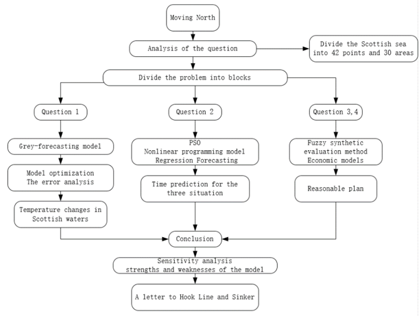

图1.解题思路

为了探究水温变化对鲭鱼、鲱鱼和苏格兰渔业造成的全球气候变化，我们构建了一个面向数据的全球变暖(DMEM)背景下渔业产业多层次评价模型。利用谷歌地球卫星数据，对苏格兰水域的42个点和30个区域建立了预测模型。并通过对相关领域的综合条件的预测，我们就题目的五个问题写了技术报告。最后，我们写信给Hook Line and Sinker，展示了关于我们对苏格兰渔业和渔民的建议。

### 数据预处理和假设

通过主成分分析，忽略了一些次要因素的影响，从而达到如何处理渔业分析和种群迁移的核心。本题中我们筛选出了四个与鱼群迁移密切相关的因素：温度、磷含量、叶绿素和食物的丰富度。在分析过程中我们发现海洋中磷含量、叶绿素含量与浮游生物含量之间存在正比关系，而影响这些东西最大的因素便是温度。在PCA分析过后，我更加坚定了这个想法。于是本文致力于通过海洋**温度**的变化来推测鱼群的迁移方向。

### 第一问求解

我们提取了1990年至2019年期间苏格兰42个点的海水温度变化，并在预测之前对数据进行优化，这使模型能够更好地处理数据并预测未来的变化。由于我们只能用过去30年的温度数据来预测未来50年的数据，所以我们选择了用较少数据就可以预测未来趋势的灰度预测模型。分别使用GM(1，1)、GM(2，1)和DGM(1，1)模型对数据进行预测。在比较了所有的模仿效果后，我们最终选择了模仿效果最好的G(1，1)模型。

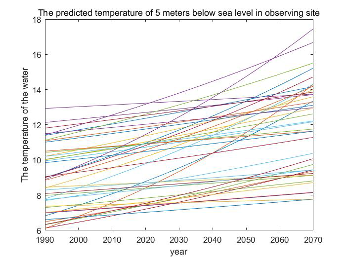

图2-1. G(1，1)模型预测海水温度

    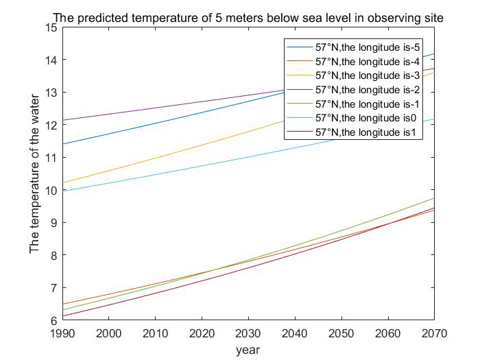    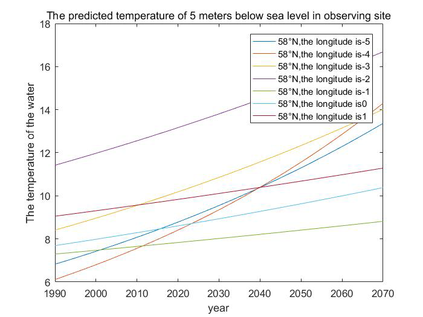 

图2-2. G(1，1)模型分区域预测海水温度

为了更好地了解鱼群的移动方向和去向，我们在二维热图上显示了2019年和2070年的海洋温度，以便更好地分析。

    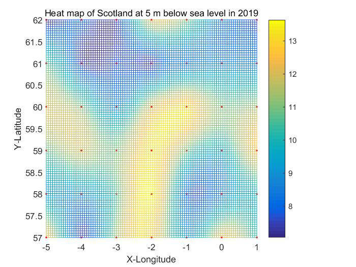    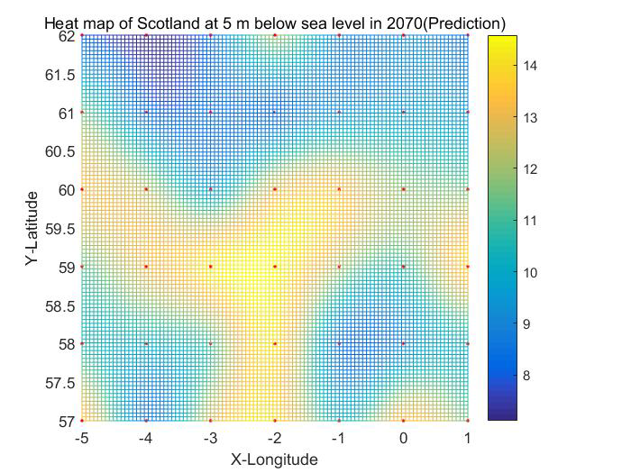 

图2-3.左图为2019年的海水热力图，右图为2070年的海水热力图

最后，根据实测卫星图像和谷歌earth显示的热图，对鱼类迁移后的范围进行了分析和预测。结果如下图所示。

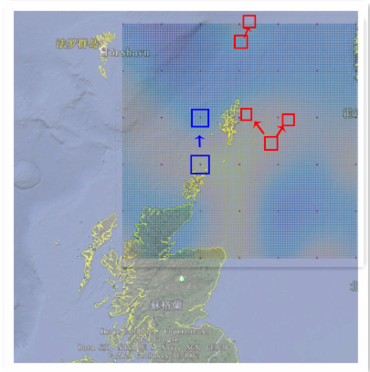

图2-4.鱼群迁移图像

### 第二问求解

建立了基于非线性规划和粒子群算法(PSO)的鱼群迁移模型。使用真实数据和现实方法对单个渔业进行建模和预测。同时，该模型也可以应用于其他类似鱼类的预测，并利用粒子群算法模拟出直观的鱼类迁移图像。

#### 参数设定

以下数据均来自于《2019年苏格兰渔业报告》。

我们假设渔场中剩下的鱼的数量取决于:

* 最舒适的鲱鱼和鲭鱼的中心离开渔场所需的时间
* 鱼群可能迁移到渔场以外的时间
* 渔船航行时间和鱼的检测时间。

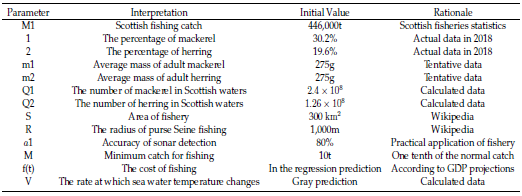

图3-1.参数设定

据调查，出海的平均时间是一个月，其中一半是作业时间，另一半是往返时间。单程时间约7天。大型渔船的平均巡航速度为7.5km/h，全单程航程为:
$$
7\times24\times7.5 = 1260km
$$
一个渔场最多可达数公里，平均渔场达一公里，说明渔场的分布很窄。2018年苏格兰海洋渔业统计数据显示，苏格兰舰队的捕捞量为44.6万吨，占欧盟总量的8%。鲭鱼占渔获量的30.2%，鲱鱼占19.6%。根据维基百科，成年鲭鱼的重量在150至400克之间，而成年鲱鱼的重量在250至450克之间。我们根据鲱鱼和鲭鱼的重量以及这些重量的个体所占的比例得到一个合理的估计。成年鲱鱼的平均重量为m2=350克。成年鲭鱼的平均重量为m1=275克。由鲭鱼和鲱鱼的捕捞量，我们可以计算出鲭鱼的捕捞吨位W1 = 132000吨。捕捞鲱鱼数为w2= 8.8万吨。

#### Logistic模型的建立

我们研究渔业的连续收获模型，横轴为鲭鱼或鲱鱼种群，纵轴为鲭鱼和鲱鱼种群增长率和趋势。我们假设鱼类的生长遵循logistics增长模型:
$$
\mathrm{x}(t)=f(x)=r x\left(1-\frac{x}{N}\right)
$$
当x = N/2，渔获率= r/2时，单位时间的渔获量可以得到最大的连续产量，且稳定。假设苏格兰政府的渔获量限制在总渔获量的10%，也就是说每年的渔获量保持在总渔获量的55%到45%之间。

鲭鱼的捕捞数量约为:
$$
Q 1=w 1 / m 1 \times 10=2.4 \times 10^{8}
$$
鲱鱼的捕捞数量约为:
$$
Q 2=w 2 / m 2 \times 10=1.26 \times 10^{8}
$$
由数据得到的模型如下图所示:

    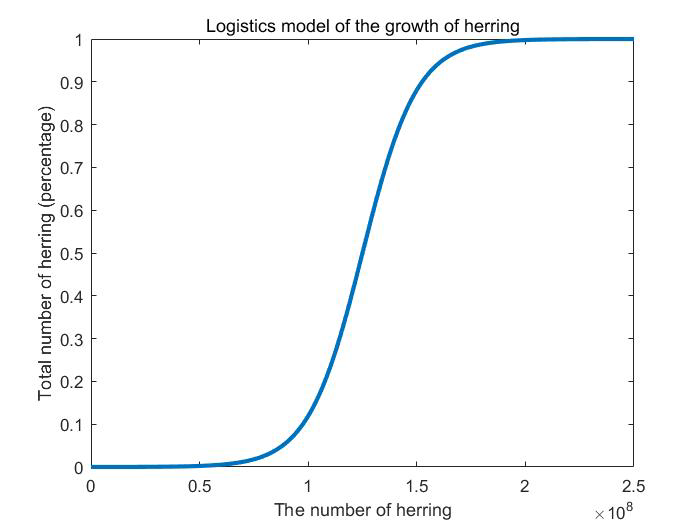    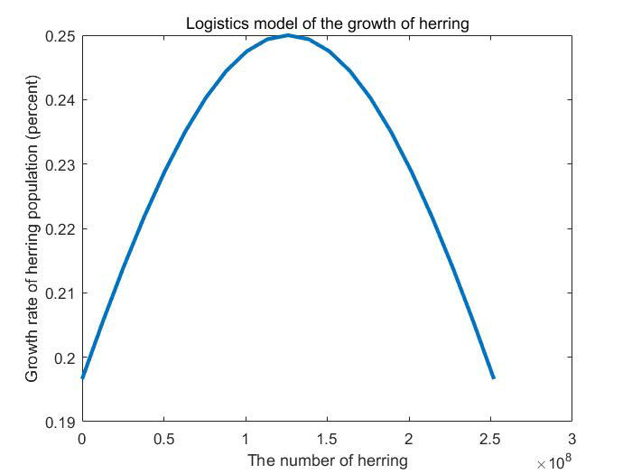 

图3-2.苏格兰地区鲱鱼的logistics模型

    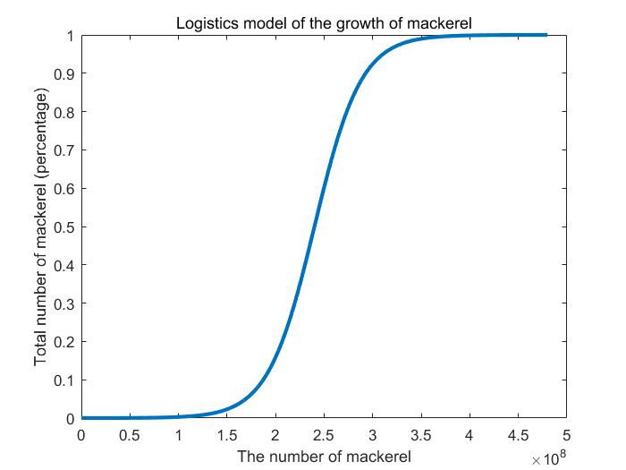    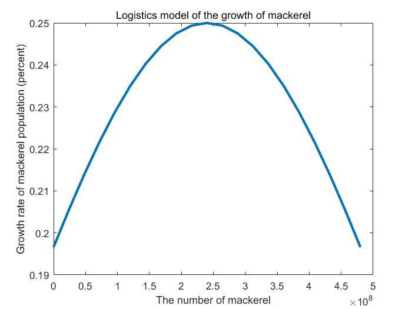 

图3-3.苏格兰地区鲭鱼的logistics模型

在21世纪的苏格兰，一种常见的捕鱼方法是Seine fishing。假设一个正常的渔场，s = 300平方公里，假设渔场是一个圆，半径为r = 10km。我们选取了半径为1000m的平均塞纳河数据，高度为半径的1/10，即100m。围网捕鱼70%-80%的时间用于检测鱼群，记录为P1，数据查询后的平均时间为6天。假设一次探测鱼群的准确率为a1，约为80%，随着声纳系统的发展，准确率也在不断提高。由于鲱鱼和鲭鱼群比较集中，所以a1可以直接认为是捕鱼的概率。

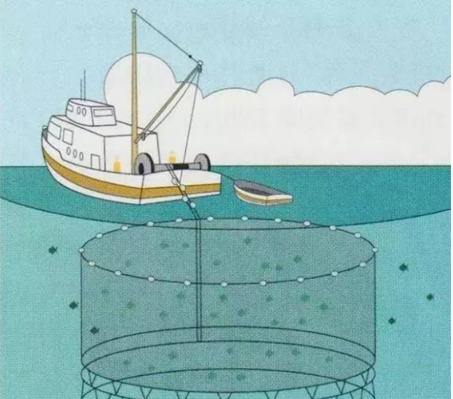

纬度约为110公里，在纬度60度，经度约为55.5公里。根据模型1的结果，鱼群在50年内从北纬59度和东经3度迁移到北纬60度和东经3度， L1=100km。我们计算了在一个正方形区域内北纬59度和东经3度到北纬60度和东经4度不同条件下的海温变化率。

#### PSO优化算法估计鱼群的迁移率

假设当适当区域的中心离开渔场时，鱼开始移动。根据第一个问题，海水温度变化范围和增长率的灰色模型，得出海洋温度的变化率在最坏的情况下是$V_{\text {worst}}=g_{1}(t)$，在最好的情况下是$2$，最可能的情况是$V_{\text {normal}}=g_{3}(t)$。

根据粒子群优化算法，如果有500条鱼的学校，我们能算出鱼学校留在原来的渔业的比例随着适用性的中心(该中心在一个二维平面上变化)，鱼的比例在最初的渔业遗留下来的，在最坏的情况下是$μ_{1}(t)$，在最好的情况下是$μ_{2}(t)$，最可能的情况是$μ_{3}(t)$。

然后我们取这三种情况的一阶导数的绝对值，我们得到鱼离开渔场的速率(百分比)，最坏的情况是$α_{1}(t)$，最好的情况是$α_{2}(t)$，最有可能的情况是$α_{3}(t)$。

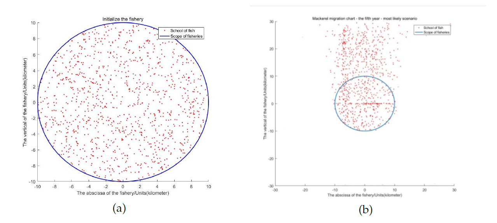

图3-4.鱼群迁移的PSO模型

我们假设渔业是正常的fernand fishery，估计有$10^{6}$条鲭鱼和$8\times10^{6}$条鲱鱼。假设该船为中型渔船，正常捕获量为100吨至300吨，捕获量为正常最低捕获量的十分之一，即M = 10吨。翻译过来就是$2\times10^{5}$条鲭鱼和$1.6\times10^{5}$条鲱鱼。

 ####  建立非线性规划模型：

规划目标:找到满足条件的最大t值。

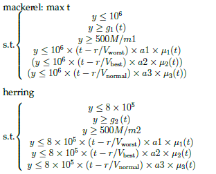

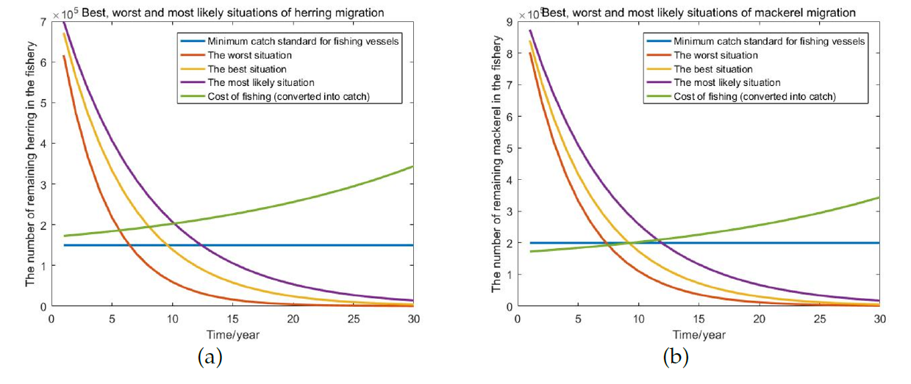

图3-5.非线性规划模型

从结果可以看出，捕捞鲭鱼最糟糕的情况是在第7年左右，最好的情况是在第12年左右，最正常的情况是在第9年左右。(准确数据分别为7.12年、11.98年和9.23年)鲱鱼捕捞最差的是第6年附近，最好的是第11年附近，最正常的是第9年附近。(准确数字分别为5.86岁、10.73岁和8.89岁)

### 第三问求解

做出改变绝对不是一个随意的决定，特别是对公司来说，我们不能仅仅通过预测海洋表面温度就得出小公司是否需要在他们目前的地点之外运营的结论，因此有更多的影响需要考虑。在本文中，我们将考虑以下影响因素:温度，距离海岸的距离，竞争程度，可达性，成本。我们将建立多层次模糊综合评价模型，以决定小公司是否需要转移或哪个地点最适合转移。

根据模糊综合评价模型，因子集U = (T, DFC, DC, A, C, S)，T表示温度，DFC表示距离海岸的距离，DC表示竞争程度，A表示可达性，C表示成本。S是一个0-1的值，0代表土地，1代表水土地。

如果我们在苏格兰寻找大型渔业公司的位置，我们会找到的几乎都远离我们限定的区域，这意味着所有位置的DC都可以设为零，以简化计算。

    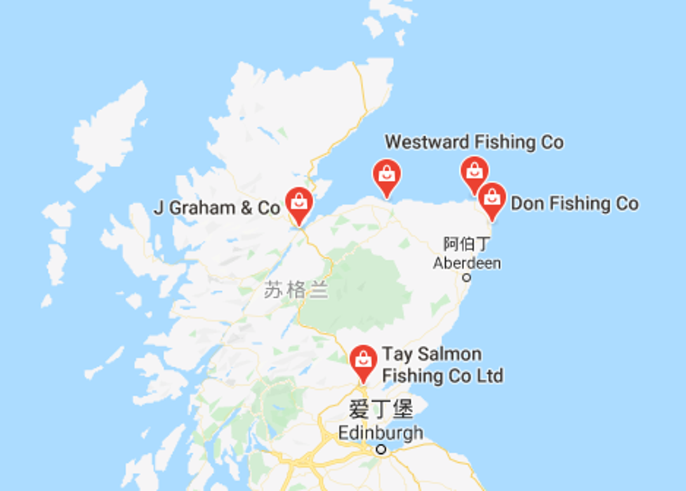 

图4-1.苏格兰渔场位置

然后，我们构建评估集。假设评估集V = (v1, v2, v3, v4, v5)， v1代表优秀，v2代表很好，v3代表好，v4代表不错，v5代表不好。因此，得到的模糊综合评价矩阵如下：

    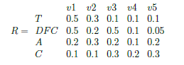 

    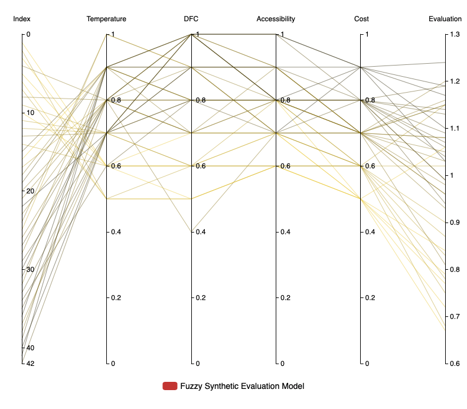 

图4-2.因子权重向量矩阵

将A和R相乘，我们可以得出(59，-3)是最适合捕鱼的地点，原因如下:

* 适应性：根据我们的预测，在2050年(59，-3)将有一个非常适合苏格兰鲱鱼和鲭鱼的温度，大约13度。另一方面，根据[数据集]，2020年(59，-4)也有一个非常适合苏格兰鲱鱼和鲭鱼的温度，这意味着鲱鱼和鲭鱼很可能在未来30年定居在这个地方。
* 竞争少：大多数主要的捕鱼公司都在苏格兰中部捕鱼，这意味着如果一家捕鱼公司在(59，-3)捕鱼，基本上没有竞争。
* Thurso是离(59，-3)最近的城市，人们从瑟索到爱丁堡只需4个半小时，更不用说货运火车了。

根据这一事实(59，-3)的平均DFC是约50公里,渔船的平均速度大约是每小时20公里,公司钓鱼有建议使用一些bug渔船的比例能够操作没有陆地的支持一段时间以及装备一些小型渔船。提出此建议是为了确保2020年渔船在(59，-4)的捕捞能力，因为小岛较多。它还可以提高渔业生产力。

### 第四问解答

我们将使用与问题3相同的模糊综合评价模型。然而，有一些小的变化。

首先，对大多数人来说，我们必须考虑领海因素。简单地说，由于领海存在一定的限制，我们必须重新进行评估，在12英里范围内增加更多的权重。

第二，受苏格兰政府保护的地区必须被排除在我们的结果之外。特别是,(57,-2),(57,-1),(57,0),(57,1),(58,-2),(58,-1),(59,-2),(59,0),(59,1),(60 0),(60,1),(61,1),(62,-5),(62 1)

    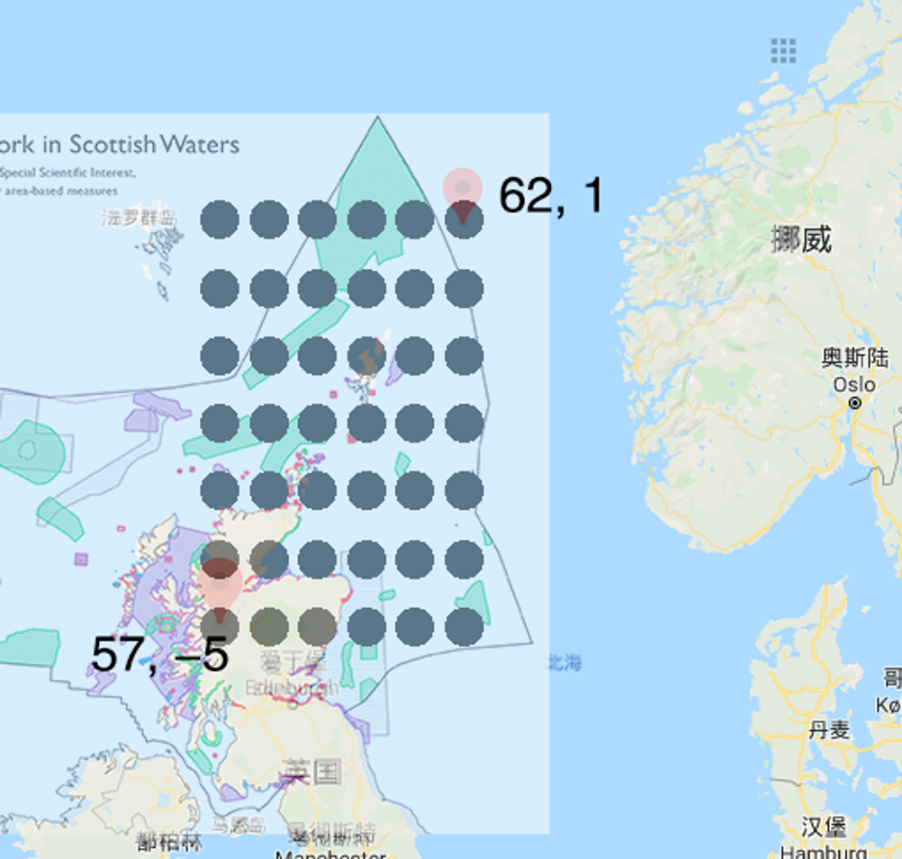 

图5-1.苏格兰政府保护区域

因此，模糊综合评价矩阵为：

    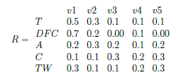 

图5-2.模糊评价矩阵

    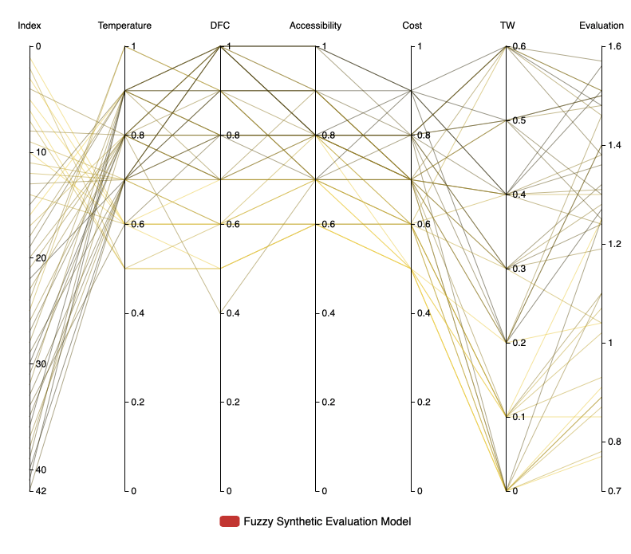 

图5-3.因子权重向量矩阵

我们可以得出这样的结论:领海因素进行考虑后,(59,-4)是我们最好的钓鱼位置,因此在2050年(59,-4)略接近主要的土地相比(59,-3)和更少的小岛,我们建议小型渔业公司可以使用中型渔船以确保最高的性价比以及生产力表现。

### 敏感性分析，误差分析以及模型优化

额，关于以下内容都是我写的，但是...你懂的。模型优化部分基本比较扯，在这里就不放出来让大家耻笑了。简单给出一些当时的分析过程：

* 敏感性分析

我们考虑三个变量对预测时间t的影响:海温变化率V、经济增长率g(t)和渔业中鱼的数量。我们探究了0-20%的水温变化速度V(最差)加减速对结果的影响。

    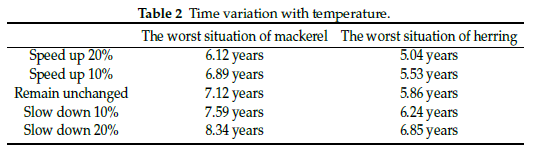 

* 误差分析：

  
    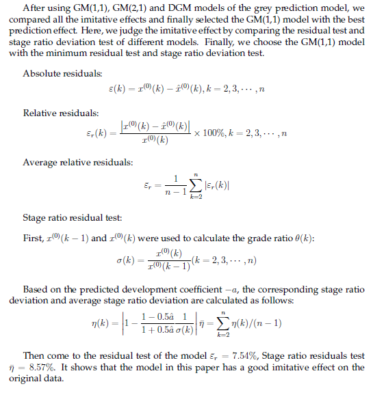 

### 优缺点分析

懒得翻译了，感觉这部分不是很重要哈哈。

#### 优点：

* The optimized grey prediction model fills in the shortcomings of the model due to the lack of data. 30 regions are divided around the most important north sea fishery in scotland, and the temperature changes in the sea area of scotland are intuitively perceived by using two-dimensional thermal maps.
* Using differential equations to account for the population of the scotland shoal, the model is more reasonable with the addition of many practical factors.The analysis of errors in the prediction results also makes the data more convincing, and the sensitivity analysis of nonlinear programming also addresses the effect of faster and slower changes in sea temperature on fish migration.
* The evaluation result of the model is in the form of vector instead of a specific value point, so it can reflect the fuzzy state of things accurately.Each step in the modeling process is quantified.Each layer of modeling will directly or indirectly affect the results, so that the evaluation of the target is relatively clear.
* The analysis model of a fishery can be applied to another fishery by changing the distance parameter, which can solve the problem of future migration of multiple fisheries.

#### 缺点：

* Since CTD data cannot provide the data of each location comprehensively, and even the data of 42 points have up to 21.1% missing data, the data preprocessing we adopted is relatively simple, so the model in this paper cannot fully represent the most accurate results.

* Not taking into account changes in ocean currents, climate and other factors, the actual state of the fishery, the annual fishing trips of fishermen and government policies, all lead to a lack of practicality in the model.

* The function of the analytic hierarchy process (AHP), which cannot provide a new scheme for decision making, is to choose the better of the alternatives.This function just explains that the analytic hierarchy process can only be selected from the original plan, but can not provide the decision maker with a new plan to solve the problem.

* The individual fishery model has little practical significance for the whole fishery.

* In today s evaluation of scientific methods, it is generally accepted that a science requires rigorous mathematical reasoning and a sound quantitative approach. But problems in the real world and how the human brain thinks about them are often not simply Numbers.

  

### 来自周哥的一封信：

信是周哥写的，茜姐翻译的，没我啥事，鉴于在最后的一个夜晚还是通宵调试Latex，最后生成论文，这份辛苦还是值得展示出来：

    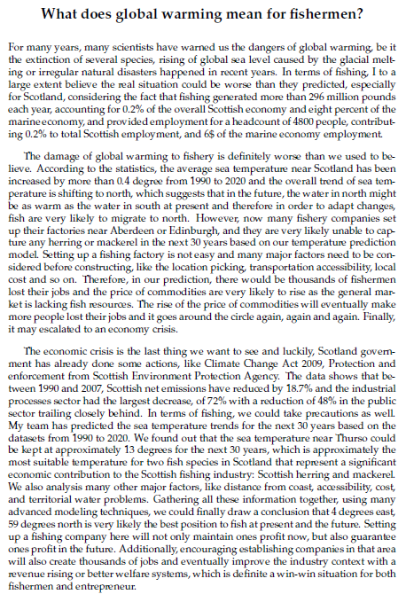 

# 后记^\_^

鉴于已经是快一年前的东西了，很多细节已经记不清了，文章如果有一些问题欢迎大家指出。本人比较懒，对于修改这个工作，只能说：**下次一定**。:slightly_smiling_face:

最后感谢自己的两位队友，周哥和茜姐。本人第一次应该也是最后一次的美赛经历大抵如此了，希望以后的情人节大家都是陪着npy，而不是对着一堆数据。