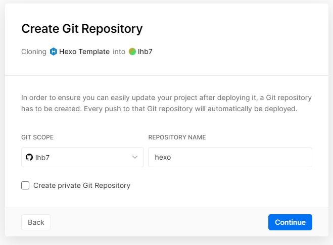
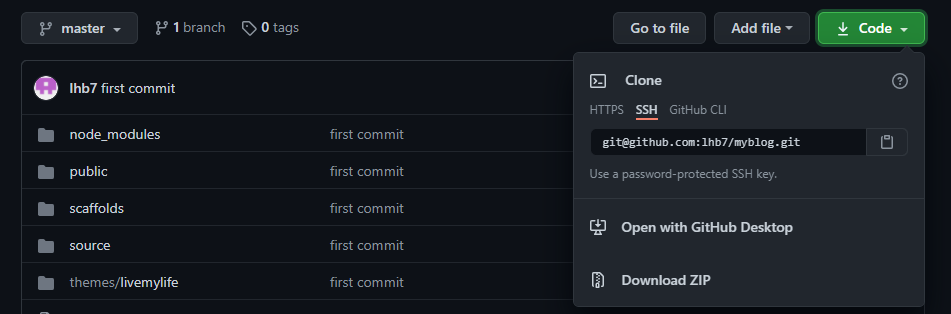

> 在江安校区商业街的倒数声中跨过了2020年，新年伊始之际，想着作为未来的一个程序猿，也得需要有一个博客来记录下自己那些杂七杂八的想法了，于是在寒假中旬开始实现了搭建个人主页的任务。

## 前言

上学期在VR实验室的时候，在周哥的指导下，翻阅了相当一部分人的个人主页，还是蛮羡慕身边的很多大佬都有着自己的网站，展示和收集着自己过去的很多经历。但我本人又是一个非常懒的货，之前的弄的公众号便在热火朝天的开始之后没了声音，想坚持做一件事是真不容易。希望未来的日子里能够慢慢地为自己的网站添砖加瓦吧，孩子这一次一定能坚持下去555 。

## 关于要使用的一些软件和工具

* Git：无论是更新Github库还是嫖资源都需要使用的软件。

* Vercel：Vercel 提供了一个云平台，可以优化整个项目开发和部署体验，它有很强大的功能值得去探索，个人使用是免费的，提供了域名，使用方便快捷。在本文中，我将域名换成了自己在阿里云上购买的域名。

* Github账号：自己的代码库和嫖别人的代码库，*GitHub*是一个面向开源及私有软件项目的托管平台，因为只支持Git作为唯一的版本库格式进行托管。

* Nodejs：因为 Hexo 需要 Nodejs 支持的、生成的，所以这是前置步骤。

* 阿里云账号：购买域名
* Hexo框架

简单解释一下个人主页的运行流程：

Nodejs，npm和hexo框架的安装是进行博客开发的基础条件。

Github账号是通用的账号，而Git可以对Github上的资源进行操作，而我们的个人主页的所有代码(包括文章内容)便放在Github的仓库里，每一次我们想更新个人主页的内容就需要更新Github仓库里的代码。

Github.io是由github pages提供的服务，也就是可以在github pages上建立你自己的博客。但是由于是国外的，你懂，访问速度很慢。于是便引入了vercel，通过vercel与Github账号绑定，我们可以用vercel来建立自己的博客，访问速度会得到大幅度地提升。vercel会提供免费的域名，但是这个域名反正我个人不会用哈哈，于是便有了在阿里云官网上买域名这么一项操作，在vercel官网的操作中，会把买到的域名与免费的域名进行绑定，从而可以通过买的域名访问我们的个人主页。

## 搭建过程

### Git的安装和与GitHub账号的绑定

Git安装网址：https://git-scm.com/download/win

Github官网：https://github.com/

如何注册Github账号和进行一些基本操作参考：https://blog.csdn.net/qq_41782425/article/details/85179912

注意：在Github填写邮箱信息的时候一定要使用非qq邮箱的其他邮箱，要不注册不了vercel的账户。

Git安装流程以及与Github账号绑定参考：

https://blog.csdn.net/huangqqdy/article/details/83032408?utm_medium=distribute.pc_relevant.none-task-blog-BlogCommendFromMachineLearnPai2-1.control&depth_1-utm_source=distribute.pc_relevant.none-task-blog-BlogCommendFromMachineLearnPai2-1.control

### Nodejs和hexo框架的安装

这部分推荐参考博客：https://www.cnblogs.com/qinghan123/p/14019115.html

* 安装nodejs

下载 nodejs：https://nodejs.org/en/


选择左边右边的安装都行，一直点默认就行。安装完以后会有两个组件：1.是 npm 包管理器；2.是 Nodejs 本身。

查看 node 的版本：

```
node -v
```

查看 npm 包管理器的版本：

```
npm -v
```

* 安装hexo框架

需借助 npm 包管理器来安装。因为国内安装镜像源很慢，所以利用 npm 安装 cnpm。我们选择使用淘宝链接安装比较快：

```
npm install -g cnpm --registry=https://registry.npm.taobao.org
```

查看 cnpm 管理器的版本：

```
cnpm -v
```

安装hexo：

```
cnpm install -g hexo-cli
```

验证hexo是否安装成功和查看hexo版本：

```
hexo -v
```

如果出现以下模样，那么恭喜你hexo安装成功。


### 使用vercel搭建个人网站

推荐博客：https://blog.csdn.net/Aixiu1016/article/details/112356387

以下描述很多话是直接复制粘贴的哈，原博主写得很到位。

1. 在 Vercel 官网（https://vercel.com/）注册一个新账户，注册新用户最好使用 Github的账户，并绑定手机号。注册完成后，可以在配置页面修改自己的邮箱地址。这里建议使用 Github 进行授权登陆，后续可以选择 Github 上的项目直接部署也会很方便的。

   

2. 之后你就可以登录系统看到自己的一些东西啦。myblog是我搭载个人网站的项目，这里可以看到的是已经与我购买的域名绑定了，也就是：binbining.com，在这之前你看到你新建的项目都应该是xxxxxxxxx.app这样的域名。


3. 接下来一步就是创建你自己的项目，在上图右上角我们可以看到New Project这个选项，点击右下角这个Browsw All Templates你可以看到很多很多的模板，从里面选择hexo模型，也就是我们需要的模板。


4. 选择模版后，进入创建项目位置选择，目前团队项目是需要专业版的，是需要收费的，选择个人，点击`PERSONAL ACCOUNT`后面的 select 按钮。


5. 这里可以选择使用什么仓库保存自己的代码，当然我们选择Github。


6. 选择 Github 后，因为我登陆的时候时使用了 Github 了授权，这里也就直接显示了我的 GitHub 名称，我们填入仓库名称为 hexo，你也可以填入其他的仓库名称，比如 blog、myblog 等。Create private Git Repository 可以勾选，也可以不勾选，勾选的话会创建私人仓库，这样别人看你的 Github 的时候不会看到这个仓库。选择好后，点击 Continue 进入下一步。



7. 以下这部分默认即可，选择Deploy即可进行创建，等待一分钟。


8. 项目就部署好了。会跳转到恭喜你，出现一个非常浮夸的界面。这时就可以点击 visit 按钮进行访问了，因为 vercel 提供了免费的域名，所以直接点击visit访问即可。


9. Hexo 博客就搭建完成了，在 GitHub 中也已经自动创建了这个博客项目。进入我们的Github账号，在个人项目可以看到同名的项目（按照刚刚的步骤名字应该是hexo，不过我之前创建的名字叫myblog）


### 在vercel上部署自己购买的域名

在vercel的个人项目主页里点击个人网站项目，就可以看到项目的详细信息，右上角有View Domains，我们可以通过这个选项关联域名。


我们可以把购买的域名复制到中间的标签栏（就是那个有mywebsite.com的框框），然后点击Add就可以了。


这时你可能发现有红点，就是域名没有部署起，这是因为域名没有进行解析。在vercel的界面会提醒你，如何设置解析的一些信息。

我是在阿里云购买的域名，于是你可以在阿里云看到自己的域名，在对应域名的右边你可以看到两个小字，也就是：解析。


根据在vercel上提示的信息填内容即可增加一条解析的信息。点击`增加记录`增加解析信息哈。不出意外在设置好了以后，vercel那边马上就能收到域名可以成功使用的信息。


### 切换主题

切换主题这个东西在Github、博客上找资源或者在hexo官网找资源都行。我选择的是在hexo官网上找个中意的模板。

hexo官网：https://hexo.io/

左上角你可以看到一排标签，选择Themes，你就可以大大方方地挑选主题了。


选择一款自己喜欢的主题，然后在主题中找到作者的Github，在里面找项目一般就能找到如何操作的文档和代码。根据提示操作，就可以切换主题。


### 本地测试主页以及主页更新

* #### 在本地测试主页

将自己Github中的个人主页项目clone到本地，比如我的：git clone 仓库地址.git。地址可以在点击Code，在SSH下面的那一栏就是。



- 在搭建之前我们已经在本地安装了 hexo-cli 的脚手架，这个时候就可以使用了。在项目文件夹下，打开终端，首先需要安装项目依赖，通过`npm install` 或 `cnpm install` 或`yarn install`皆可安装依赖。
- 依赖安装成功后，执行`hexo server -p $PORT`即可启动项目，其中$PORT 默认 4000，你也可以修改端口。hexo 也提供了简易方式启动命名：`hexo s`，启动后在浏览器访问：[http://localhosst:4000](http://localhosst:4000/)即可打开。

* #### 主页更新

在本地可以使用以下代码创建文章：

```
hexo new "文章标题"
```

hexo中各文件夹的作用建议参考：

在typora中更新好文章之后，使用以下代码可以在本地查看修改后的个人主页：

```
hexo cl ##清除缓存
hexo g  ##打包
hexo s  ##启动本地服务
```

启动后在浏览器访问：[http://localhosst:4000](http://localhosst:4000/)即可打开，满意之后便可以部署到自己的博客上。

这里有两条路，一条是直接使用Git更新对应仓库的代码，一条是直接通过hexo d来上传代码，我就不多说了，详细操作可以查看相关博客。


## 后记

文章写于博客搭建完成前，很多的细节可能并没有提及，在搭建网站的过程中呢，发现大多数博客展示的搭建过程都是本文的一个子集，于是搭建过程查看了很多的博客。本文算是比较完整的一个博客搭建过程，希望对大家有一些帮助，如有错误欢迎指出。


