> 在2019年的最后一个月开始尝试接触目标识别和跟踪的知识，那时候的我甚至连pycharm都没有用过，还不知道各个框架的概念。在盲目的代码复现和学习中，时间来到了2020年的三月份，了解到了中软杯的赛题，努力开始有了一个方向，也是我第一个负责和成功完成的项目。项目获得第九届中国软件杯大赛的全国二等奖，至于比赛的各种奇奇怪怪的事情我们暂且不用过多关注，最后能取得这么一个成绩，是我非常满意的。

## 项目背景

智慧交通建设是关系到我国国计民生的重要基础行业，我国政府对其发展极其重视。中共中央、国务院近两年先后颁布了《国家“物联网与智慧城市”研发计划2019年度项目申报指南》《关于进一步加快智慧城市建设的若干意见》等政策，明确提出推动大数据、信息共享和智慧社会的发展。

基于对公共交通路口摄像头类似视角的影像数据进行处理，采用计算机视觉的算法对各种复杂的交通场景进行检测识别。项目使用计算机视觉技术打造了提供多功能智慧交通相关的软件。

## 项目简介和功能描述

本项目设计一种基于计算机视觉的智能摄像系统，运用了精确的单目标跟踪、多目标跟踪、实时目标识别、OCR技术、矩阵透视、射线法等多种技术，然后将技术整体展示，利用PYQT5开发出软件端，将数据可视化结果直接展示在用户眼前。

中软杯官网赛题要求：

* 程序实现基本的机动车检测、车牌识别和至少实现一种交通场景功能。
* 该项目不仅实现了机动车检测、车牌识别，同时完成了如下交通场景功能。

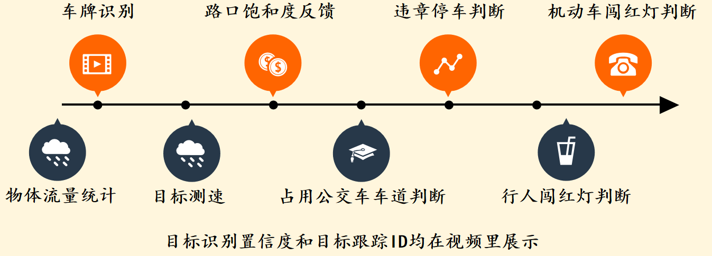

## 关键技术

### 基于YOLO v4和Deep SORT的识别和跟踪

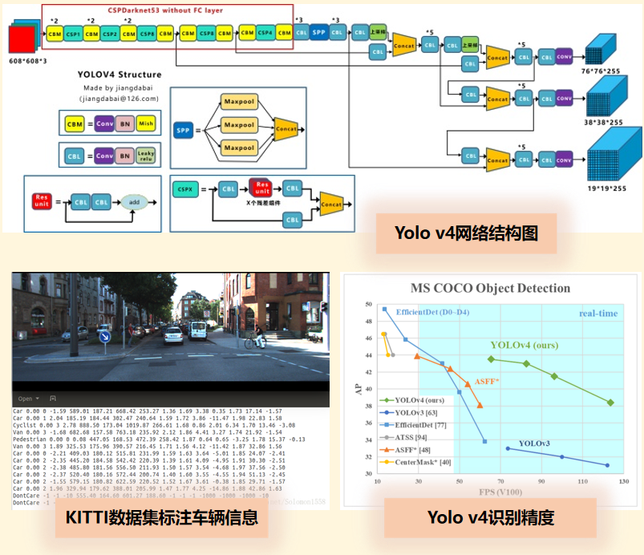

* #### 车辆数据集单独训练

本项目采用YOLOv4网络作为目标检测算法，采用Deep SORT网络作为多目标跟踪算法。我们使用KITTI训练集自己训练车辆数据集，该训练集可以识别80个不同的物体，能超实时地识别目标的类型。

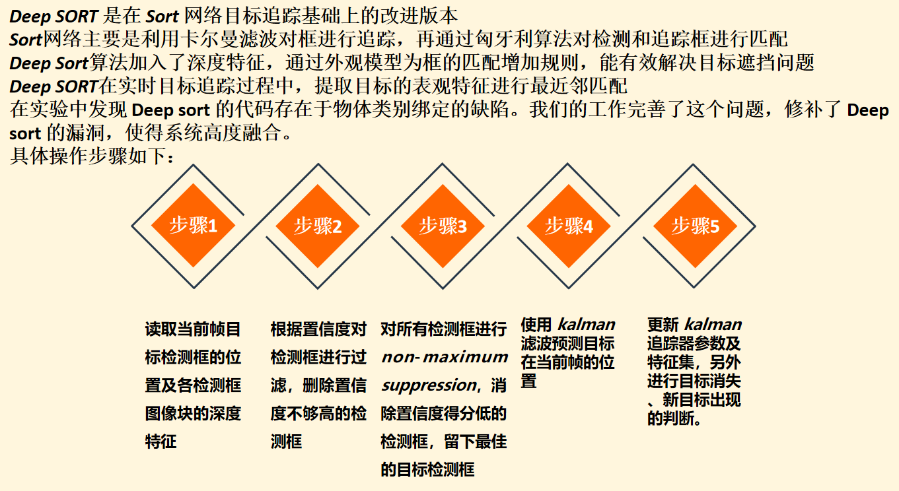

* #### 针对交通场景识别六类主流物体

 应用在交通路口处理，可以识别人(person)、轿车(car)、货车(truck)、公交车(bus)、摩托车(motorbike)和红绿灯(traffic light)，并且将种类和置信度(CI)展示在视频处理结果中。

Yolov4基础模型和改进模型可以识别80类物体

### 基于改进lPRnet和mtcnn的车牌识别

这部分的操作是周哥主攻的哈，我们使用改进 MTCNN + SPL + LPRNet 结合的针对车牌识别的神经网络。可以到达实时的效果，并且车牌识别精度有所提高。

经过自主改进的网络稳定性和识别能力大大增强，同时依旧维持了 LPRNet 的实时性。通过高效的动态规划对网络结果实时处理，是我们的算法兼顾可解释性和精度。在实践中，我们的车牌识别甚至可以实时对肉眼不可鉴别的目标作出准确识别。

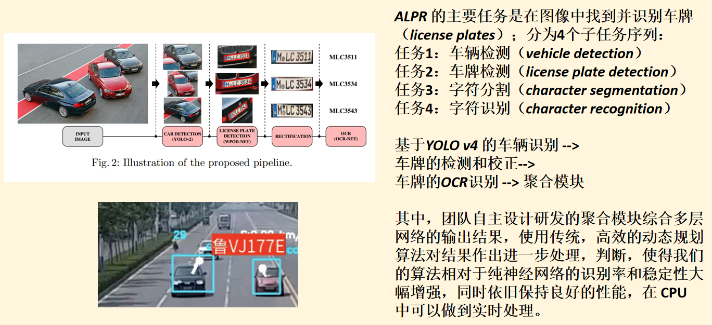

倾斜视角的车牌面积较小，将车牌变成正视图的视角后，车牌面积会增大，从而增加车牌的识别率。

车牌校正

设置resizing factor：

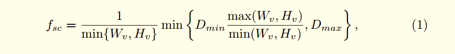

### 基于透视变化的实时目标速度检测

本项目利用基于透视变化的测速方法达到车辆测速目的

问题：摄像头存在俯角

将视频画面经过透视变换转换成俯视图，画面中所展示的视角和路面垂直，每像素所代表的实际物理距离保持固定不变，通过像素位移差和时间差计算目标速度。

具体操作方法如下：首先，我们在原视频画面选取四个点，这四个点构成视频画面所记录的真实世界中的某个矩形顶点（如斑马线方格的四个顶点）。其次，我们在二维平面中选取构成同样像素大小的矩形的四个顶点。然后，根据前后各四个顶点的坐标，我们可以计算出从原图到俯视图的透视转换矩阵。在得到透视转换矩阵后，我们就可以将原视频画面的任意一个点坐标转换成俯视图中的点坐标。例如我们在原视频画面中选取目标在第**N**帧的坐标为(**Xn**、**Yn**)，目标第**M**帧的坐标为(**Xm**、**Ym**)，那么经过透视矩阵的转换，对应点在俯视图画面中的坐标分别为为(**Xn’**, **Yn’**)和(**Xm’**, **Ym’**)。然后，我们利用俯视图中两点的坐标计算车辆速度。由于俯视图中的每像素距离代表的实际物理距离是固定不变的，我们不妨假设为**W**，那么很容易得到目标车辆沿道路方向行驶的实际物理距离**s**。然后根据帧与帧的时间间隔得到第**N**帧到第**M**帧之间的时间**t**(**ms**)。最后，由于在较短时间内目标车辆的行驶可以看作匀速直线运动，那么我们可以利用速度公式（其中**fpst**代表一帧的时间间隔）：

    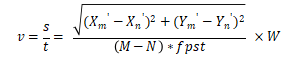    

    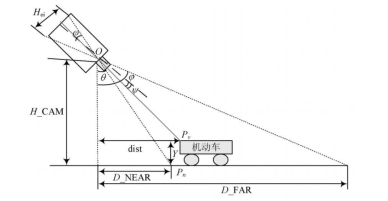    

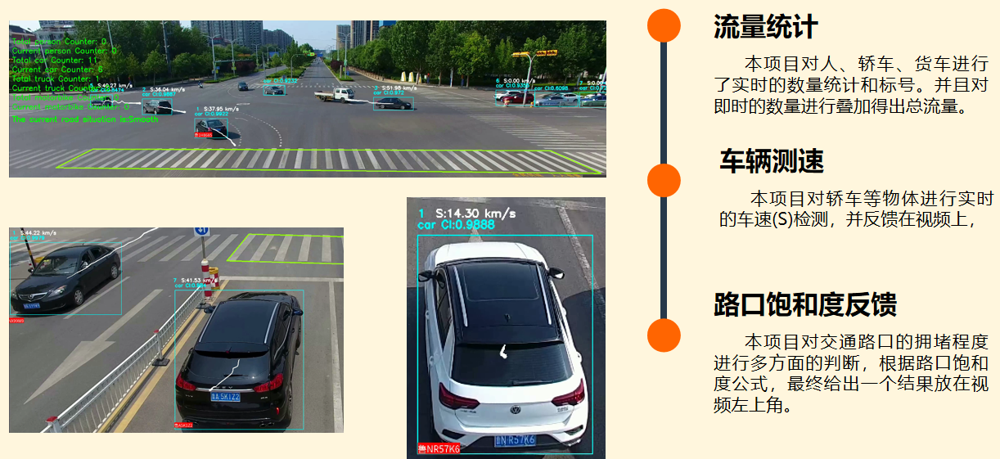

### 基于射线算法违章区域车辆检测

我们基于Deep sort追踪的机动车违停技术：我们根据每个跟踪中心的位置，判断它是否停车和是否越线。在UI界面下手动圈选违章区域，然后通过判断跟踪中心的移动情况是否在违章停车区域，公交车道区域，来进行机动车和非机动车是否违章的判断。

采用了射线法判断跟踪中心点是否在划定区域内，**射线法**就是以判断点开始，向右（或向左）的水平方向作一射线，计算该射线与多边形每条边的交点个数，如果交点个数为奇数，则点位于多边形内，偶数则在多边形外。该算法对于复合多边形也能正确判断。

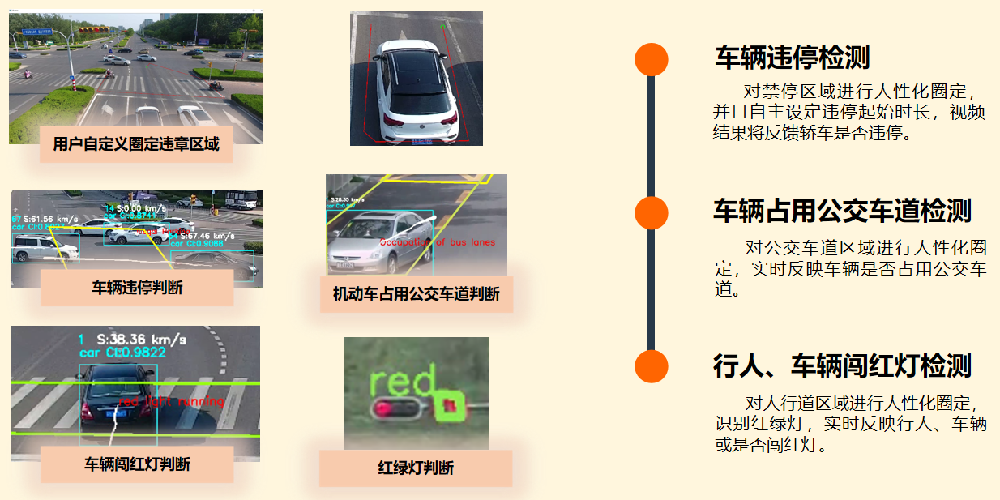

## 项目成果展示

软件开发时间耗时6个月，算法模型历经了三次更新升级，最终在8月初完成最终模型。

本项目于2020年5月收到计算机软件著作权登记证书，申请人为本次参赛的三位选手。目前已经开发出PC软件端。

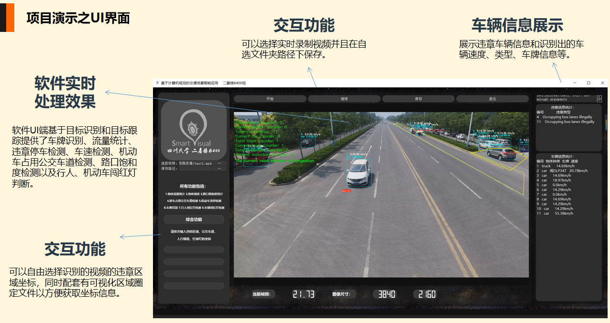

在PYQT封装后的整个文件夹大小为2.47GB，我们设计成了直接可以在windows电脑上运行的exe程序，我换了个图标大概长这样子。

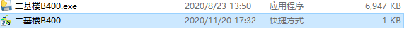

软件端的实测图片大概长这样：

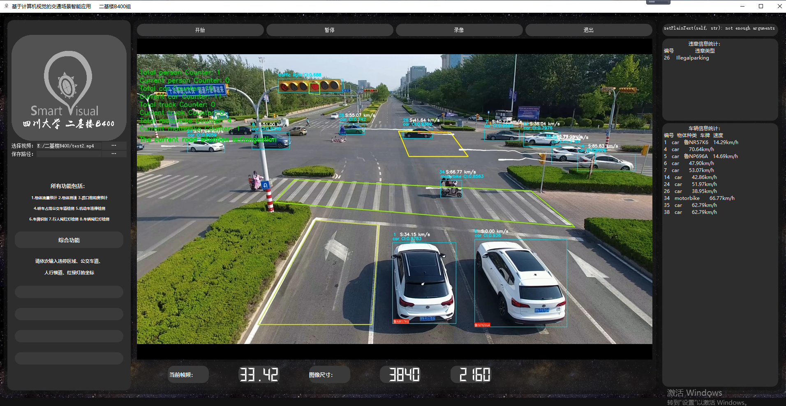

我放一个我们预先录制的答辩视频在这，可能会比较直观一点趴：

     
    <iframe style="         position: absolute;          width: 100%;          height: 100%;          left: 0; top: 0;"          src="//player.bilibili.com/player.html?aid=971022307&bvid=BV1Qp4y1s7Xv&cid=279724597&page=1"          scrolling="no"          border="0"          frameborder="no"          framespacing="0"          allowfullscreen="true">     </iframe> 

## 后记

关于中软杯的最后一场答辩已经过去了4个月了，还想得起来那是一个午后，中午饭我恰了一碗泡面。线上视频的这边是我和宇浩和涛哥三个人挤在宿舍里狭小的课桌前，对面是一群坐在敞亮大厅里的企业和高校的专家。放松心情，我们顺利地完成了比赛的答辩，没有正式的服装，甚至听不清评委问题的时候，我们三还做出奇怪的姿势，靠近笔记本电脑的音响。视频两头的气氛是完全不搭调，好在我们进了决赛第二轮，保底已经是二等奖，答辩的结果已经有底，整个过程还是极为放松。

至于一等奖队伍确实也做了比我们更多的事，只是但从答辩过程来看，对他们的一些疑问依然存在于我们的脑海中。只是更好的结果对于我来说，也不是很重要了。这一段完整的比赛经历带给我的成长是毋庸置疑的，在收尾的时候感谢那段时间一起付出的队友们，大家都特别的给力，也感谢那段时间付出了心血的自己，没有那段熬夜的日子，应该也没有现在躺着度日的我。

附奖状：

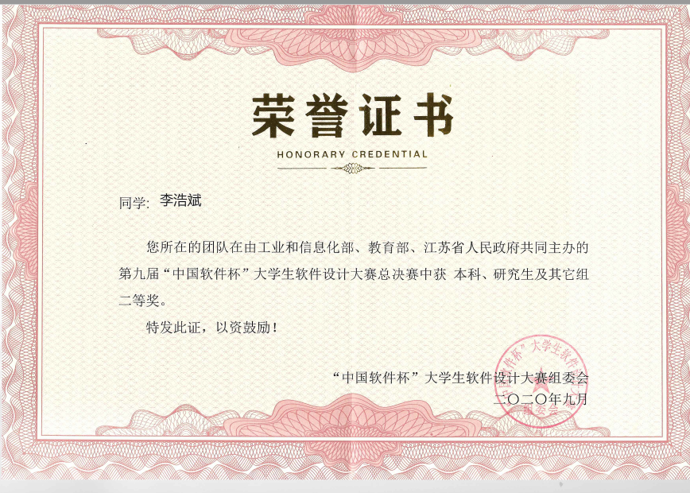