> 
>
> 项目基于从ABS拿到的东北虎数据集而建立，改进基于PaddlePaddle 的Mobilenetv2 模型并使用Django 搭建实时的野外东北虎监测平台，将摄像头传回的视频进行实时地处理后，返回给前端来实现可视化展示。和另外两位队友在短时间之内搭建的平台，最终在人工智能创意赛的全国决赛取得了三等奖的成绩，但是这个成绩好像并不重要哈哈。浙江三日游成为了在疫情笼罩下的2020年少有的精彩回忆之一，也是2020年的一个转折点吧。

## 项目简介

本项目应用方向是野生动物保护，我们团队基于百度飞桨平台开发野生东北虎的识别与监测系统。通过自主收集的东北虎数据集完成模型训练。在未来该平台将于与摄像系统结合，广泛应用于野生动物自然保护区，结合大数据、人工智能等进一步对东北虎个体及其他物种进行目标识别、数量统计、实时监测，位置记录，有效地进行东北虎的监测与保护工作。

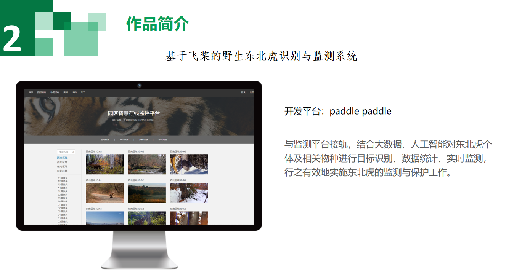

## 项目技术内容

### 数据集

我们在学校实验室的支持下，结合互联网和实地考察，我们收集并创建了自主的东北虎数据集，一共有4621张图片，使用labelme标注东北虎框一共7321个。

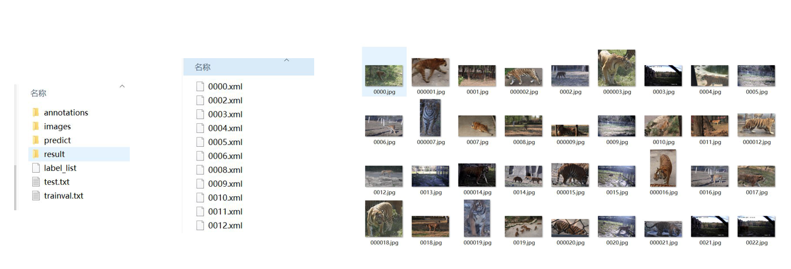

### 项目实现思路

考虑到我们是一个实时的监测平台，对预测速度有一定的要求，并且需要模型易于部署，我们选择了基于Mobilenet v2的改进模型。本项目可分为两部分组成，一是通过基于改进Mobilenet v2的目标识别模型，二是基于Django搭建起来的实时野外东北虎监测平台，将摄像头传回的视频进行实时地处理后，返回给前端来实现可视化展示。

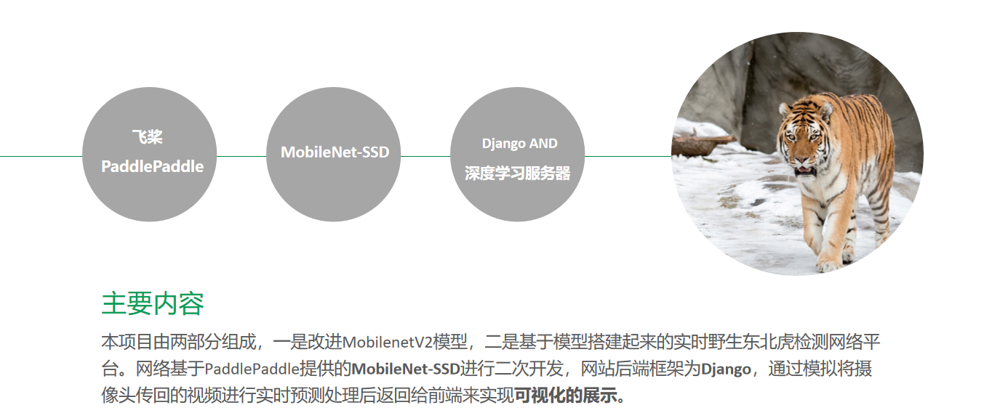

### 算法改进

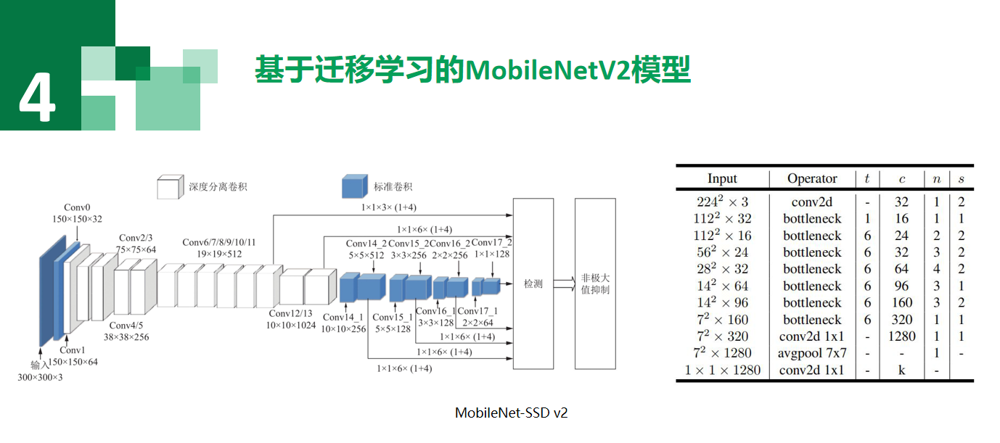

传统的 SSD 网络在提取的特征图上直接进行回归和分类，易造成目标的分类定位错误而降低检测的准确率。SSD 算法用低层特征图检测小目标，高层特征图检测大目标，低层卷积层分辨率高但语义信息低、感受野较小，小目标特征提取不充分；高层卷积层语义信息充分、感受野较大，可提取更多特征信息。

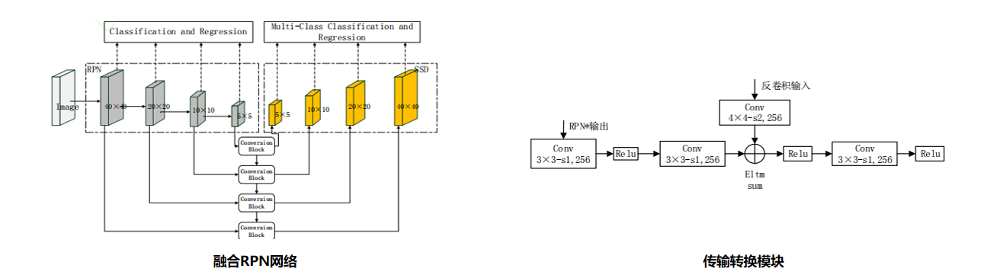

针对这个问题，我们将 RPN 网络引入进 SSD 网络，使用传输转换模块将两个网络相连接，从而构建出一种新的SSD网络。同时继承一步式和两步式检测方法的优点，在RPN经过细化的先验框基础上进行回归反卷积，使特征相融合，传输给SSD网络。在RPN经过细化的先验框基础上进行回归反卷积，使特征相融合，集成大规模上下文信息，增大感受野，增加低层网络的语义信息，提高检测精度。

这一步骤有效地删除一些负样本先验框，减小分类器的搜索范围，降低目标分类或定位的错误率，为 SSD网络的回归操作提供更好的前提条件。

在特征融合上，在MobileNetv2模型的基础框架上，对 Conv3_3、Conv4_3、fc7、Conv6_1、Conv7_1、Conv9_2 特征层，用 padding=0 的 1×1 卷积核做卷积操作，保证了融合时的通道统一，然后使用双线性插值使特征图大小统一。最后采用连接融合的方式得到了不同大小的特征图，改进后的模型较MobileNetv2模型的特征层语义信息更丰富，能更好地表达目标特征。

同时为了增强浅层网络对小目标的检测能力。我们将 Smin 和 Smax 的值调整为 0.15，0.95，预测框的IOU 设置为 0.45，NMS 设置为 0.4，这样能够有效避免由于目标过小导致在训练阶段，真实标签无法找到相应地先验框与之匹配的问题。

### 算法对比

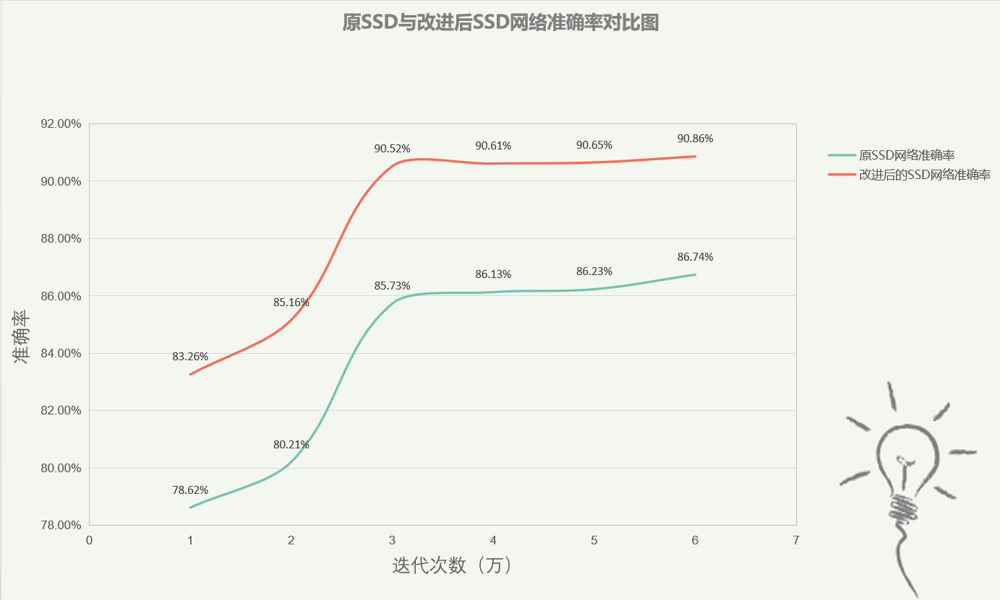

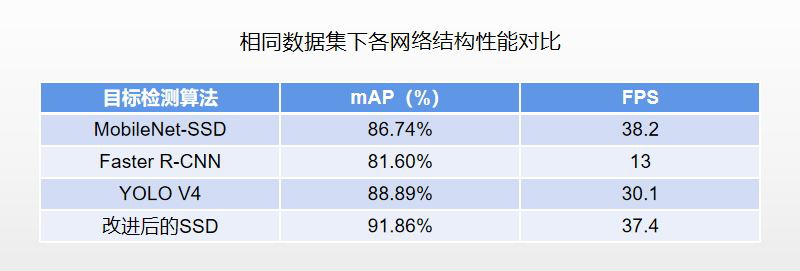

在算法对比中可以看到，迭代 1 万次时，MobileNetv2网络的准确率只有78.62%，而改进后的网络准确率可达到 83.26%，迭代 6 万次逐渐趋于稳定，但是改进后的网络准确率始终高于原网络，最高可达90.86%。

我们用同一数据集进行了横向对比，改进后的网络 mAP 为91.86%。相比于Faster R-CNN 模型，检测精度提升了 10.26%；相比于 YOLO V4模型，检测精度提高了2.97%，检测速度提高了7.3FPS；相比于MobileNetv2模型，检测精度提高了 5.12%。

### 成果展示

#### 园区监控终端

基于我们训练得到的模型，我们搭建了适用于自然保护区的智能监测平台。我们将通过规划后在区域内设置一定数量的摄像头用于实时监测，摄像头将搭载我们训练的识别模型，进行实时的识别和跟踪，标记出被识别的目标，并将信息传输给后台，供工作人员查看数据。

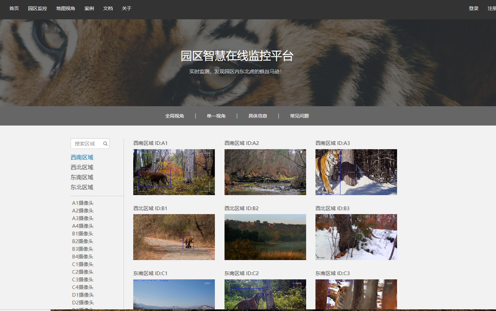

    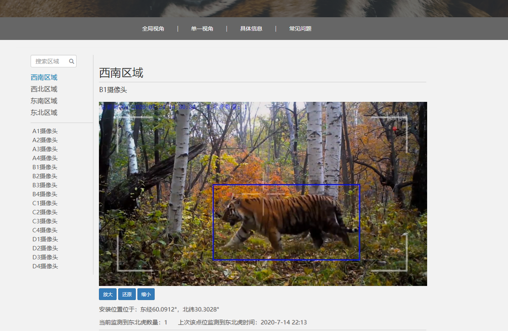   

同时，系统会对识别到的东北虎进行持续的标记跟踪，密切关注每一只东北虎个体，记录其基本情况。通过串联园区内各个位置的摄像头，系统会自动绘制园区内每只东北虎的行为轨迹图，并以地图可视化的方式展现出来。一旦摄像头监测到东北虎出现异常状况或行为轨迹图可疑，系统将自动上报给后台工作人员，以便及时处理。

    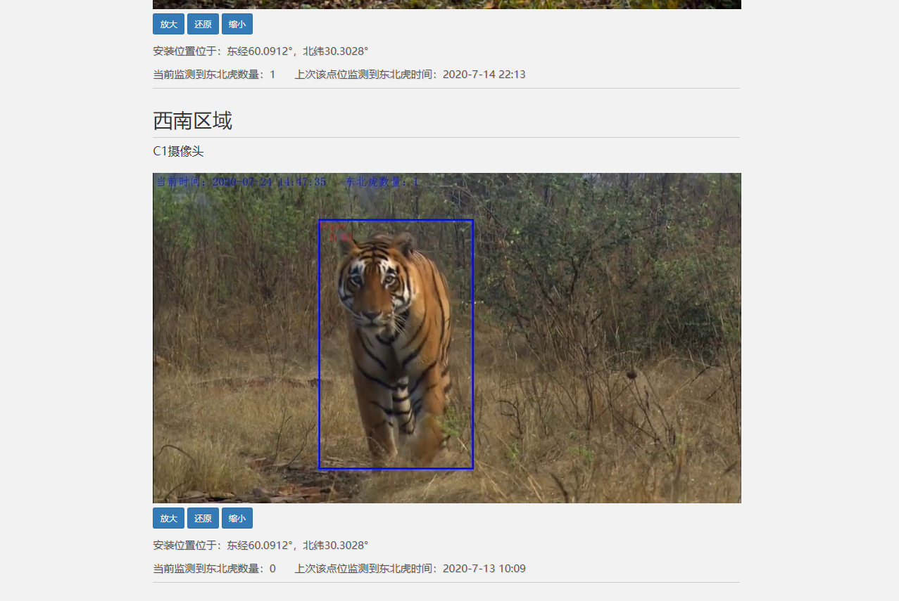    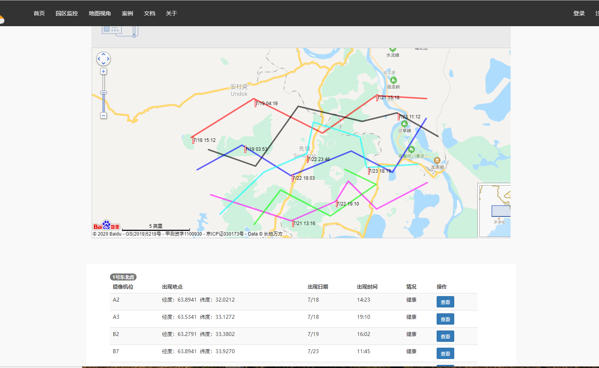 

#### 一些展望

完成该项目所需要的技术算是比较基础的，而在我们的前期调查中发现，相关的产品并没有广泛应用于自然保护区和动物园，不知道是出于成本的原因还是什么。我认为相关的产品或是项目可以广泛应用于各个自然保护区，基于不同的数据集，对不同种类的动物进行监测。如果可以争取与政府的动物保护部门达成合作，以进行进一步的推广，弥补现有的市场空缺，从而广泛应用国内各类自然保护区中。

对于野生动物的纪录片拍摄以及各种野生动物科研，这样的系统依然有着非常显著的作用。我们可以利用相关系统更快地找到野生动物的栖息地和活动轨迹，以便于更好的拍摄和研究。同时大大减少了相关人员花在寻找东北虎的时间和精力上，大大加快了效率。

想法是好的，希望在未来的日子里中可以有人能够实现这样的想法。

## 关于人工智能创意赛

### GEEK YOUTH集训营

2020年参加了很多的比赛哈，人工智能创意赛是我个人认为主办方非常良心的比赛之一。在得知了我们进入全国决赛之后，百度公司举行了GEEK YOUTH线上集训营，三天的讲解可谓是收获满满，请到了非常多很厉害的教授，我们也可以直面Paddlepaddle的技术人员，深入了解这个平台。如果没有疫情，应该会飞去北京参加线下的集训营，又是一场三天的白嫖旅行，也算蛮可惜的。因为可能记笔记比较认真，在最后的时候也作为代表表达了自己对集训营的一些看法，照片吗，网上好像直接搜我名字能搜到就不贴了。

最后也收到了来自组委会的两波良心大礼包，赞:slightly_smiling_face:

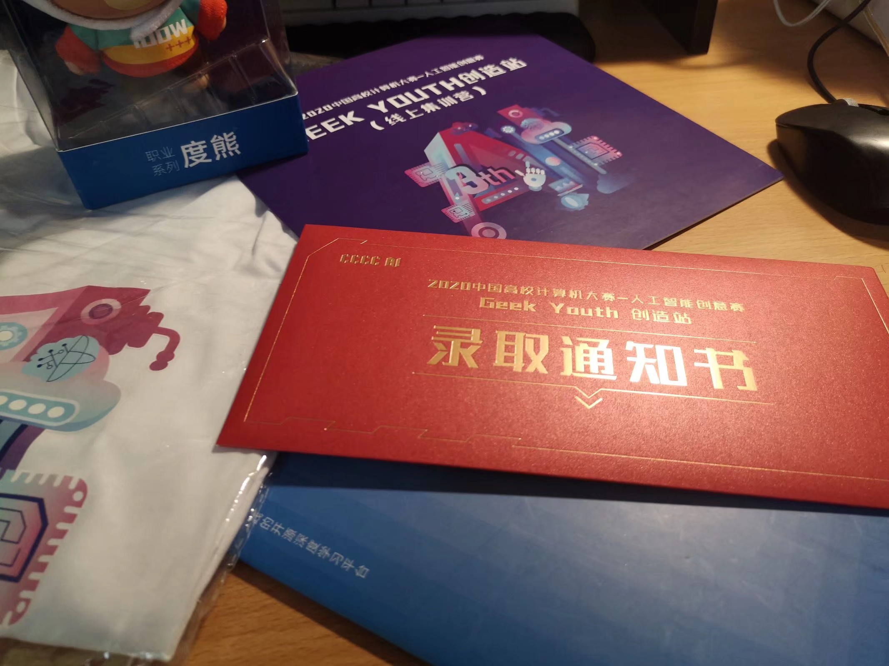

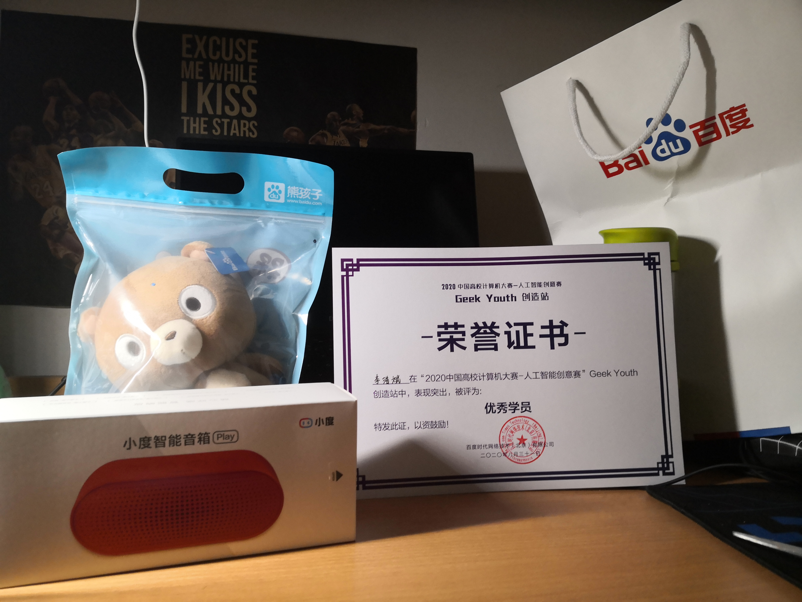

### 杭州决赛行

在第一天下飞机之后，我们来到了决赛举办的酒店，感觉应该是个旅游度假村，面积和江安的宿舍区有得一比。组委会安排住的是1500一天的别墅啊啊啊啊啊啊，直接震惊到爆炸，来几张图表示敬意。中午去恰了杭帮菜还算不错，下午逛了逛酒店，整个度假村的风景还算蛮不错的，本来两人一间房，但是我的室友并没有来（一人一间房很爽），于是便有了后来的夜宵局哈哈。

整个决赛显得非常的专业，来了很多专业的教授和院士，现在想来没有去问问保研信息还蛮后悔的。在经历了第二天一整天紧张刺激的答辩(吹牛)后(下午溜出去到西湖玩了)，本来想去体验一下杭州的夜生活，奈何晚上九点街上就已经空空荡荡，于是小酌两杯后回到了酒店。结果在阿杜的鼓吹下，氪了一手原神，本来是钟离的up池，没想到保底出了一发七七，孙宝的运气可不是人人都有，生活总会有点意外。

第三天在杭州的机器人小镇举行了颁奖仪式，颁奖典礼后便是一个峰会，还是认真听了一部分，机器人小镇的很多东西也蛮好玩的。第三天晚上参加了晚宴，非常豪华，本来和uncle说的是想和班主任小姐姐合张影，后来又怂了。当天成都发生了五角星事件还一度担心能不能正常回学校，而第四天中午便乘飞机回了学校，过程也挺顺畅。

杭州行并没有留下什么谈得上的遗憾，留下了一堆不成文的照片。

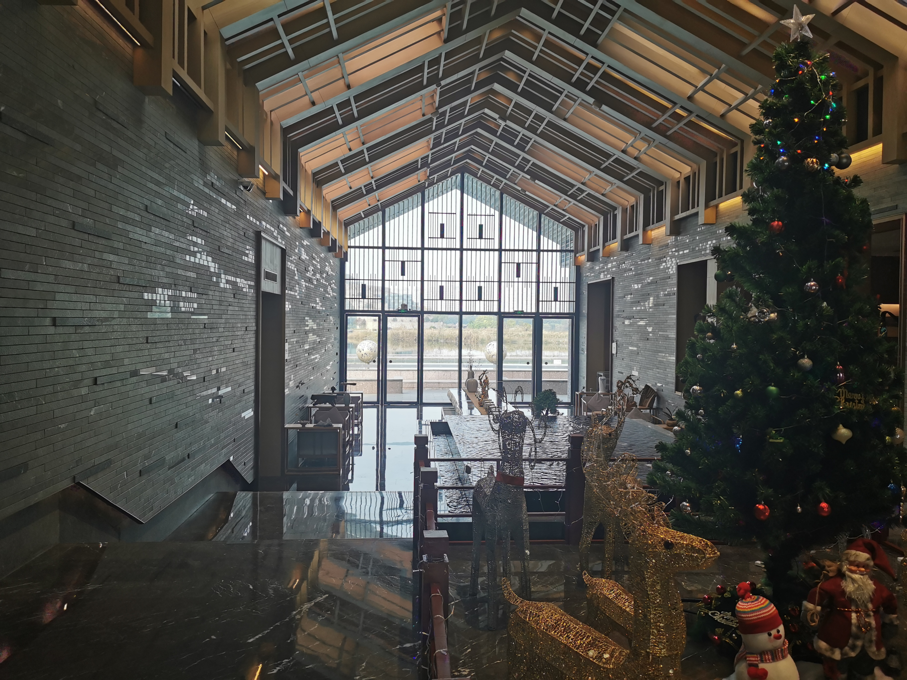

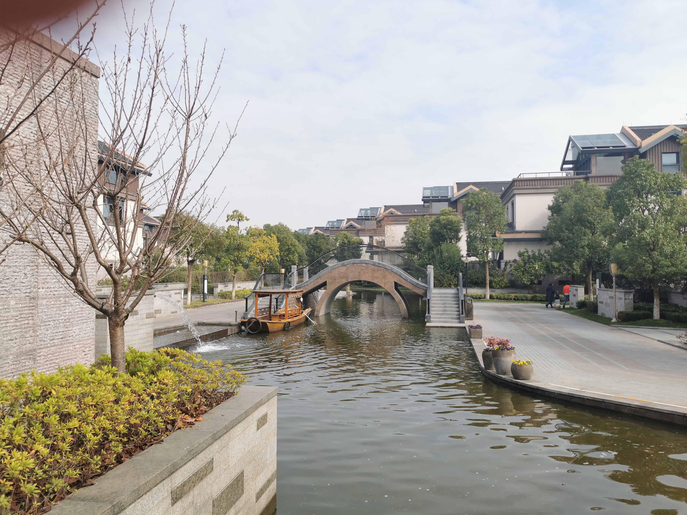

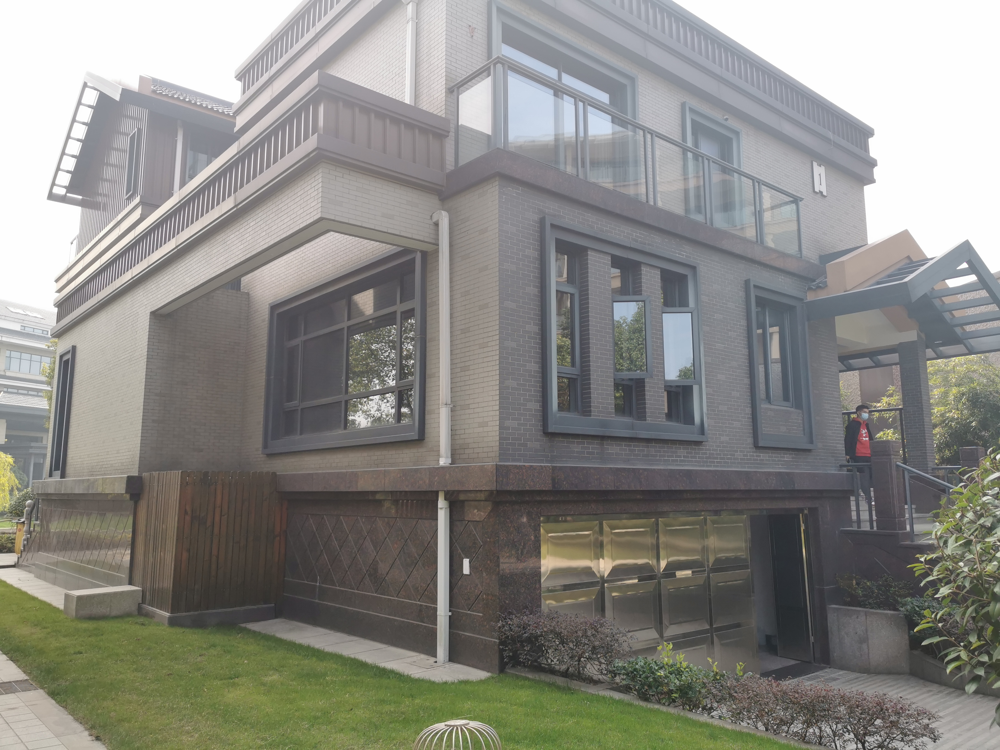

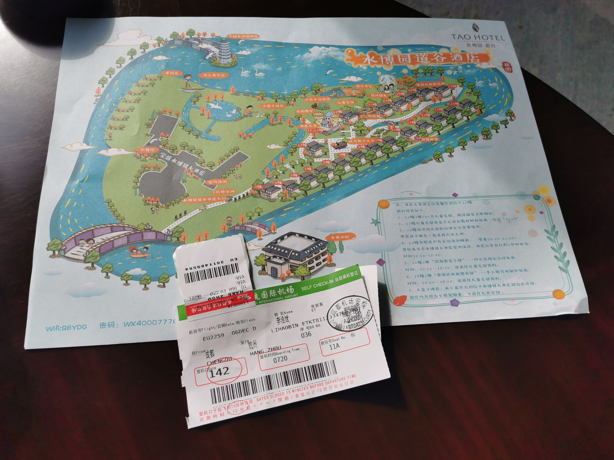

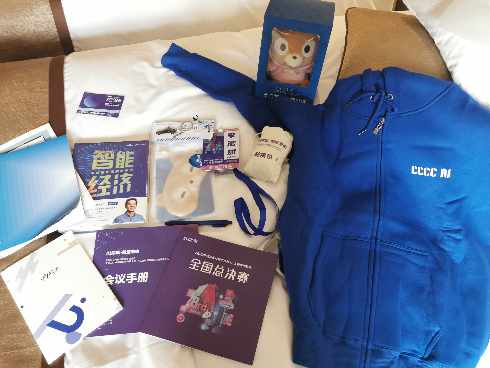

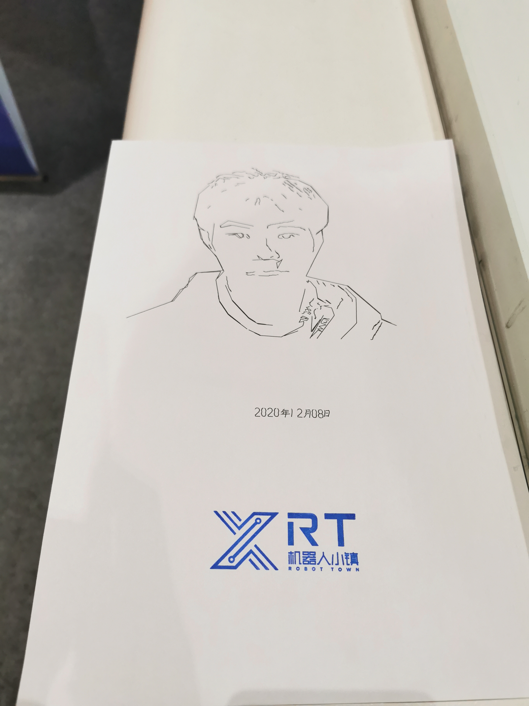

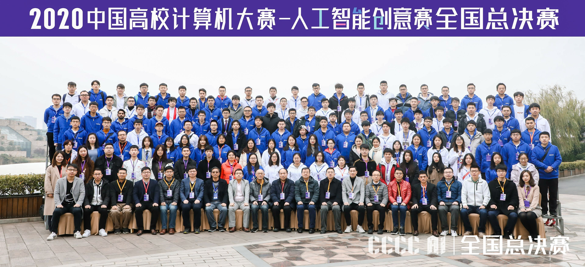

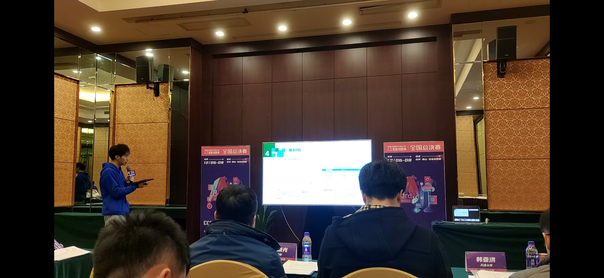

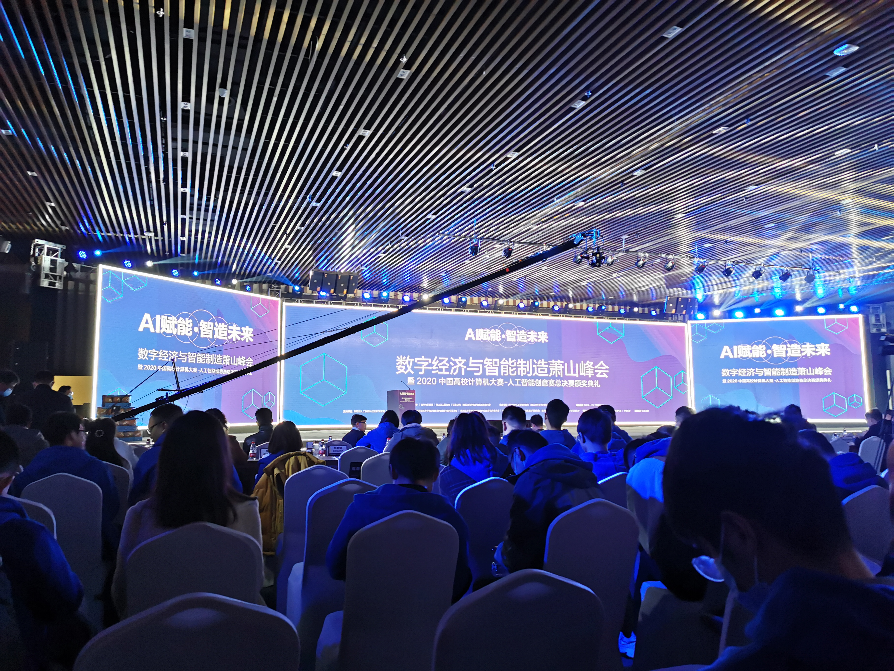

## 后记

感谢两位队友uncle悦和阿杜的付出，这个项目并没有花费我们太多的时间，所以最终能拿到这样的结果也算非常满意了。同时我们也明白了，在与其他学校的项目对比中，我们由于从来没有接触过硬件相关的知识，也没有硬件可以展示，在PK中会显得比较薄弱，这可能也是纯软件的一些弱势吧，希望在之后的学习中能够接触到有关硬件的一些知识，得到一些进步。

最后附上参赛作品的三分钟链接，阿杜在寝室剪辑的，现在看上去确实还蛮憨憨的，纪念意义还是拉满：

[SCUCS_01](https://www.bilibili.com/video/BV1PX4y1K7TC)：https://www.bilibili.com/video/BV1PX4y1K7TC

     
    <iframe style="         position: absolute;          width: 100%;          height: 100%;          left: 0; top: 0;"          src="//player.bilibili.com/player.html?aid=713571339&bvid=BV1PX4y1K7TC&cid=279720799&page=1"          scrolling="no"          border="0"          frameborder="no"          framespacing="0"          allowfullscreen="true">     </iframe> 

