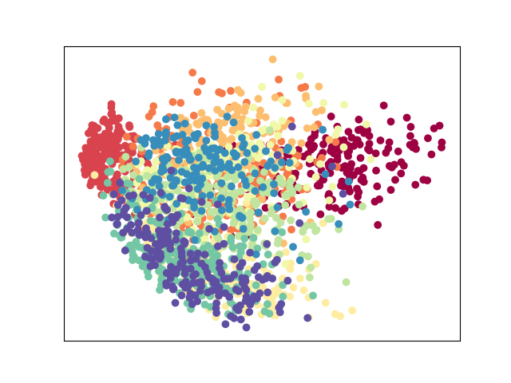
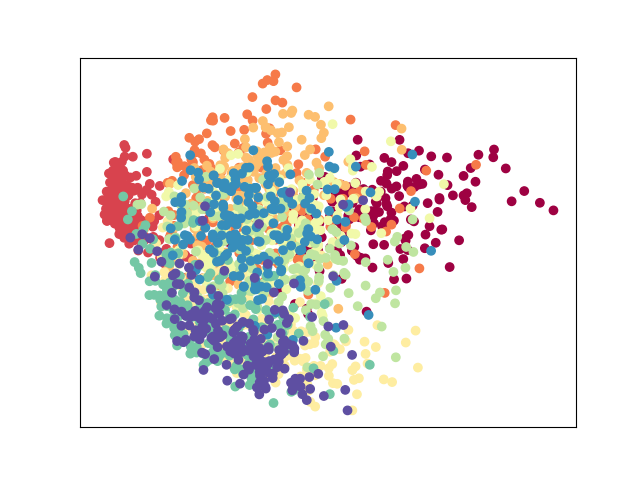

> 子空间学习系列主要讨论从PCA发表开始到2010年中，子空间学习相关论文。本文立足于论文：**A Tutorial on Principal Component Analysis**。基于此进行概念的梳理和思考，尝试从数学的角度去阐述PCA的动机，目标函数和限制等。额，然后本系列的解释应该是中英文混合，私以为用简略的句子生动地描述复杂抽象的概念，需要对算法有着极为深刻的理解和一定的勇气。显然我水平不够，如果强制翻译一些原文的描述和概念，难免不太妥当。

# 摘要：

主成分分析：Principal Component Analysis（PCA）是无监督的<u>降维</u>算法，相信各路博客上已经有了不少的理解和推导。所以本文的解释会比较简略只提重点部分。需要注意的是本文有下划线的部分是一些需要了解的基础概念，由于篇幅，我就不在后面解释，望读者自行查阅。

# Question&Answer：

## 假设

- Linearity：线性框架把降维问题定义在<u>基（basis）</u>的变化上。如下的<u>线性变换（Linearly transform）</u>$P$可以把原始基变化为另一个基，这个新的基是原始基的线性组合，通过是更好地表示原始数据集$X$。

$$
PX=Y \tag{1}.
$$

- Large variances have important structure：这里的方差是指将数据投影到某个主成分后数据的方差。 这个假设还包含这样一种理念，即数据具有高<u>信噪比</u>：
  $$
  SNR=\frac{\sigma_{\text {signal }}^{2}}{\sigma_{\text {noise }}^{2}}.
  $$
  因此，具有较大相关方差的主成分代表重要结构，而具有较低方差的主成分代表噪声。

- The principal components are <u>orthogonal（正交）</u>：这个假设使得 PCA 可以用<u>特征值分解（eigendecomposition）</u>的方法解决。矩阵$A$中不同特征值对应的特征向量是相互正交的（即相互<u>点乘</u>为0），如下所示。为了不让公式混乱，这里的$A$表示原始数据集$X$，别误会，
  $$
  Ax_{i}=\lambda_{i} x_{i}\\
   x_{i} \cdot x_{j}=\delta_{i j}=\left\{\begin{array}{l}
      others, \ i=j \\
      0, i \neq j
  \end{array}\right..
  $$

## 目标函数

PCA 的目标是最大化降维之后的<u>协方差矩阵</u>$D=YY^{T}$的<u>迹</u>，换种说法，最大化降维之后的数据在主成分（特征向量）上的方差。如下所示：
$$
\begin{array}{ll}
\underset{\mathbf{P}}{\arg \max} & tr(\mathbf{P} \mathbf{X} \mathbf{X}^{T} \mathbf{P}^{T}) =  tr(\frac{1}{n} \sum_{i=1}^{n}\left(\mathbf{P} \boldsymbol{x}_{i}\right)^{2})\\
\text { s.t. } & PP^{T}=I_{d\times d}.
\end{array}\tag{2}
$$
其中，$P$ 是特征向量的集合，$x_{i}$ 是特征向量，$d$是降维后的维度。如果我们确定了$d$，在约束条件$PP^{T}=I_{d\times d}$下，最终我们会得到唯一解$P$。<u>当然在这类降维算法中约束条件的设定其实值得讨论，我在之后的文章里面会解释不同算法下约束条件的作用。</u>由于$x_{i}$是<u>正交</u>基的限制，协方差矩阵$D$的非对角线元素都为0，而协方差矩阵的对角线元素则是特征值，表示如下：
$$
rerank \ \ x_{i} \ \ by \ \ sort(\lambda_{i})\\
\lambda_{1}\geq\lambda_{2}\geq\cdots\geq\lambda_{d}\\
X=[x_{1},\cdots,x_{d}]\\
D=\left[\begin{array}{lllll}
\lambda_{1} & 0 & \cdots & 0 & 0\\
0 & \lambda_{2} & \cdots & 0 & 0\\
\vdots & \vdots & \ddots & \vdots & \vdots \\
0 & 0 & \cdots & \lambda_{d-1} & 0\\
0 & 0 & \cdots & 0 & \lambda_{d}
\end{array}\right].
$$

## 方差，协方差，冗余和信噪比的关系

- 方差（Variance）：Variance is a way of measuring the degree of dispersion of a data set，如下所示：
  $$
  \sigma_{A}^{2}=\frac{1}{n} \sum_{i} A_{i}^{2}.
  $$

- 协方差（Covariance）：Covariance measures the degree of the linear relationship between two variables. 协方差为正表示这两个数据正相关，协方差为负表示两个数据之间负相关。数学表达如下：
  $$
  \operatorname{cov}(X, Y)=\frac{\sum_{i=1}^{n}\left(X_{i}-\bar{X}\right)\left(Y_{i}-\bar{Y}\right)}{(n-1)}
  $$
  其中 X 和 Y 是需要评估相关性的$n$维向量。当有多个数据点需要表示相互之间的相关性时，我们用协方差矩阵$C$来表示。

- 冗余（Redundancy）：Redundancy refers to whether the data expressed in the current dimension is redundant. PCA通过最大化协方差矩阵的迹来消除冗余。值得注意的是，冗余度越高表示数据间相关性越大，用某些维度去表示。

在本文的假设中，协方差（多数据则是协方差矩阵的迹），冗余和信噪比之间是正比关系，如下所示：
$$
convarince \propto redundancy \propto SNR=\frac{\sigma_{\text {signal }}^{2}}{\sigma_{\text {noise }}^{2}}
$$
冗余定义为当前维度是否是多余的，噪声代表那些多余的维度。 协方差反映了数据之间的相关性。 不同维度之间的相关性越大，当前维度就越冗余。

## PCA和协方差矩阵的关系

PCA首先是通过预处理之后的原始数据$X_{pre}$进行协方差矩阵的计算得到了$C_{X}$，通过线性变化之后得到降维之后数据的协方差矩阵$C_{Y}$。协方差矩阵由如下两个特点：

- 在对角线元素中，根据假设，大的特征值代表重要的主成分。
- 在非对角线元素中，大的协方差值对应于高冗余。

具体的过程是找到正交矩阵$P$使得$\mathbf{C}_{\mathbf{Y}} \equiv \frac{1}{n} \mathbf{Y} \mathbf{Y} ^{T}$ 是对角矩阵，转换过程如下所示：
$$
\begin{aligned}
C_{Y} &=\frac{1}{n} Y Y^{T} \\
&=\frac{1}{n}(P X)(P X)^{T} \\
&=P\left(\frac{1}{n} X X^{T}\right) P^{T} \\
&=P C_{X} P^{T}.
\end{aligned}
$$

## PCA，特征分解(ED)和奇异值分解(SVD)之间的关系

PCA可以通过特征分解和奇异值分解来求解。具体而言，在PCA这个算法中，ED只使用了SVD的右奇异矩阵。SVD是一个更普通的解决方案，因为狭义的特征值分解需要原数据$X$是一个方阵，而SVD并没有这个限制。接下来我们将推导，**为什么说ED只使用了SVD的右奇异矩阵**。

在狭义的特征值分解中，我们求解特征向量和特征值需要把原数据集$A$（为了不让公式混乱，这里的$A$表示原数据集$X$，别误会）表示为$Ax_{i}=\lambda_{i}x_{i}$。在ED中$A$是一个对称正定矩阵，$A$可以表示为：
$$
A=XX^{T}=EDE^{T},
$$
其中$D$是一个对角矩阵，其中对角元素为特征值，$E=\{x_{1},x_{2}, \cdots, x_{n}\}$的每一列都是特征值对应的特征向量。 $E$ 是归一化的正交向量集。 我们可以得到 $E^{T}=E^{-1}$。然后进行如下推导：
$$
\begin{aligned}
Ax_{i}&=\lambda_{i}x_{i}\\
AE &=ED \\
XX^{T}E &=ED \\
XX^{T}E &=EDE^{T}E \\
XX^{T} &=EDE^{T}.
\end{aligned}
$$
以上的推导把特征分解推向了与SVD类似的表示，即类似于SVD的右奇异矩阵，接下来我们展示SVD的过程：
$$
\begin{aligned}
\mathbf{M} &=\mathbf{U} \mathbf{\Sigma} \mathbf{V}^{T}\\
M^{T}M &= V\sigma^{T} U^{T}U\sigma V^{T}\\
A &= V\sigma^{2}V^{T},
\end{aligned}
$$
其中 $A=M^{T}M$ 是正定矩阵，U 和 V 是归一化正交向量集，所以我们有 $U^{T}U=I$。

## 缺点

PCA 不能处理线性不可分的数据，数据可能位于多个子空间中。我们可以从方程（1）中看出。降维后的数据$B$是由原始数据$A$通过线性变换$P$得到的。PCA 不是为处理非线性数据而设计的，所以在处理非线性数据时，效果可能不太行。

## 实验效果(MNIST)

由于Sklearn已经对PCA做了很多的优化，需要代码的朋友可以之间调库解决：

```python
from sklearn.decomposition import PCA
def Pca(test_data, train_data, component):
    solver = PCA(n_components = component) #test_data为测试集, train_data为训练集, component为降维后的维度
    solver.fit(train_data)
    return solver.transform(test_data)
```
<div>			
    <center>	
    
    
    </center>
</div>

<center style="color:#C0C0C0;text-decoration:underline">图1. Left: Train dataset, Right: Test dataset.</center>

# 总结

很多地方说的不是很细，本篇博客更重要的是去回答一些看论文中的问题。

