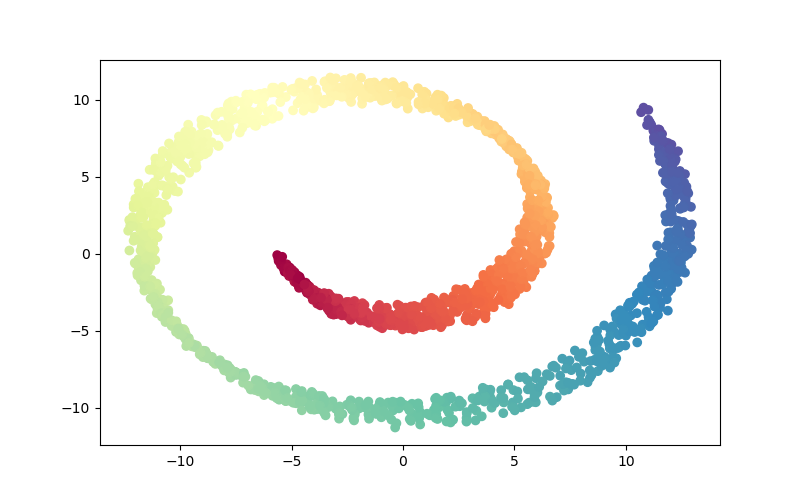
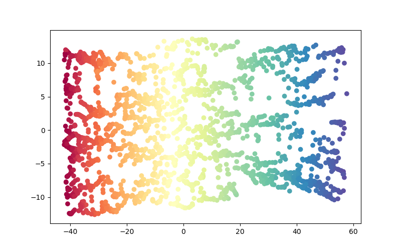
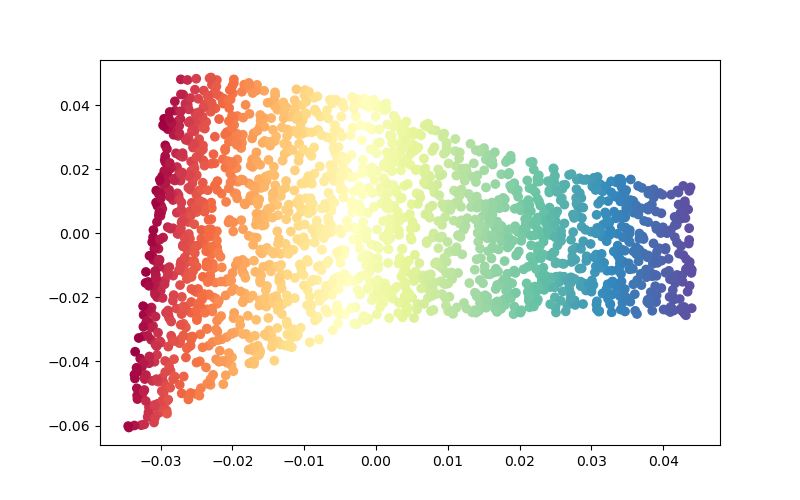
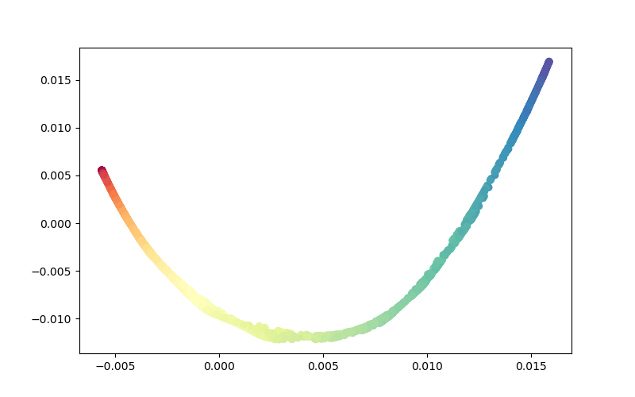

> 子空间学习系列主要讨论从PCA发表开始到2010年中，子空间学习相关论文。本文立足于论文：**Laplacian Eigenmaps for Dimensionality Reduction and Data Representation（2003 NC）**。基于此进行概念的梳理和思考，尝试从数学的角度去阐述LE的动机，目标函数和限制等。额，然后本系列的解释应该是中英文混合，私以为用简略的句子生动地描述复杂抽象的概念，需要对算法有着极为深刻的理解和一定的勇气。显然我水平不够，如果强制翻译一些原文的描述和概念，难免不太妥当。

# 摘要：

降维算法出现在信息处理的许多领域，包括机器学习、数据压缩、科学可视化、模式识别和神经计算。 其中，其中，Laplacian Eigenmaps (LE) 是一种用于表示高维数据的几何动机算法，它利用了图 Laplacian、流形上的 Laplace Beltrami 算子以及与热方程的联系之间的对应关系 。LE算法为非线性降维提供了一种计算效率高的方法，保留了局部特性和聚类的一种自然联系。 在本报告中，我们尝试以数学方式解释 LE 的主要思想，并讨论 PCA 、LLE 和 LE 之间的区别。本文的解释会比较简略只提重点部分。需要注意的是本文有下划线的部分是一些需要了解的基础概念，由于篇幅，我就不在后面解释，望读者自行查阅。

# Question&Answer：

## 假设

LE 假设数据是从平滑、紧凑的<u>黎曼流形</u>中采样的，并且流形上有均匀的概率分布。进一步来说，

- 数据是从光滑、紧凑的<u>黎曼流形</u>中采样的<u>光滑流形</u>，即数据是无限可微的。更具体地说，从流形到低维空间的映射 $f:\mathbb{M} \rightarrow \mathbb{R}$ 是两次可微的
  $$
  \begin{gathered}
              f^{\prime \prime}(x)=\lim _{\Delta x \rightarrow 0} \frac{f^{\prime}\left(x_{0}+\Delta x\right)-f^{\prime}\left(x_{0}\right)}{\Delta x}.
          \end{gathered}
  $$

- 流形上有一个均匀的概率分布，即采样密度使得每个数据点具有 $2d$  邻居的数量级，这些邻居在流形上相对于输入空间中的某个度量定义了一个大致线性的补丁。

## 解决的问题

LE 试图通过使用图拉普拉斯算子之间的对应关系来为位于嵌入高维空间的低维流形上的数据构建表示，从而降低平滑、紧凑的黎曼流形的维数。

## 理解LE算法中的拉普拉斯映射

### 拉普拉斯图

LE 中的<u>拉普拉斯算子</u>是指 LE 计算数据集的低维表示，该表示通过使用拉普拉斯矩阵 $L$ 的概念在某种意义上最优地保留了局部邻域信息。拉普拉斯矩阵可以用两个矩阵之间的差来表示，
$$
L=D-W
$$
其中$W$是使用一些策略来连接的邻接矩阵（参见之后的具体步骤），$D$是一个对角矩阵，其对角元素为度数（$D_{ii}=\ sum^{n}_{j=1}W_{ij}$)。此外，流形拉普拉斯算子有几种可能的近似方案，例如，我们可以计算具有以下权重的图拉普拉斯算子，
$$
W_{ij}=\begin{cases}
    H_{t}(x_{i}, x_{j})e^{-\frac{\|x_{i}-x_{j}\|^{2}}{4t}} & \text{ if }\|x_{i}-x_{j}\|< \epsilon \\
    0 & otherwise
    \end{cases},
$$
其中 $t \in \mathbb{R}$, $\epsilon \in \mathbb{R}$ ，$H_{t}$ 是热核函数。

### 映射

在解释特征映射之前，我们应该了解什么是<u>映射</u>和<u>特征分解</u>。LE 中的特征映射是指数据的嵌入映射近似于<u>Laplace Beltrami 算子</u>的特征映射，它们是在整个流形上本质上定义的映射。 从<u>流形</u>的定义，数据的特征映射$f$如下所示：
$$
 \forall x_{i} \ \exists x_{U(i)}: \ \Phi(x_{U(i)})\rightarrow (f_{1}(i), \cdots, f_{m}(i)) \ (f \subseteq \mathbb{R}^{n}),
$$
其中 $f=[f_{0}, f_{1}, \cdots, f_{k-1}]$ 是拉普拉斯图的特征映射。

## 目标函数

LLE的目标函数是为了最小化重构损失，最大程度的保持数据之间的局部关系（为什么保持数据间的局部关系可以进行更好的降维？下一个回答将解释）：
$$
\begin{gathered}
        \arg \min_{Y^{T}}\Phi(Y)=tr(Y^{T}LY) \\
        \text{ s.t. } Y^{T} D Y=I_{d\times d},\textbf{y}_{i}^{T}D\textbf{1}_{1\times d}=0,
    \end{gathered}\tag{1}
$$

其中 $L=D-W$, $D$ ($D_{ii}=\sum_{j=1}^{n}W_{ij}$) 和 $w$ 是对称的，$d$是降维之后数据集的维度，$Y=[\textbf{y}_{1}, \textbf{y}_{2}, \cdots, \textbf{y}_{n}]$是降维后的数据集。

## 算法流程

给定 $k$ 个数据点 $x_{1}, x_{2}, \cdots, x_{k}$ in $\mathbb{R}^{l}$，我们构建一个有 $k$ 个节点的加权图，每一个节点代表一个数据点，加权图的边表示两个数据点之间的关系。 现在通过计算图拉普拉斯算子的特征向量来构造嵌入图。 算法过程的三个步骤如下所示：

### 第 1 步：构建邻接图

动机：LE 明确考虑了数据可能驻留在其上的流形的局部结构。 因此，LE 构建了一个包含数据邻域信息的邻接图。

假设：原始数据的构造图是连通的。（当然你可以用一些其他方法让它联通）

如果 $x_{i}$ 和 $x_{j}$ 满足以下策略的条件，我们将边放在节点 $i$ 和 $j$ 之间。 因此，提出了两种策略：

- $\epsilon$-neighborhoods（参数 $\epsilon \in \mathbb{R}$）： 如果 $\|x_{i}-x_{j}\|<\epsilon$ ，节点 $i$ 和 $j$ 将会被连接，其中范数通常是在 $\mathbb{R}^{l}$上的欧几里得范数。
- $n$ nearest neighbors：如果 $i$ 位于 $j$ 的 $n$ 个最近邻居中或 $j$ 位于 $i$ 的 $n$ 个最近邻居中，则节点 $i$ 和 $j$ 由一条边连接。 

### 第 2 步：选择权重

在我们构建了邻接图之后，我们需要计算相邻点之间边的权重来构建邻接矩阵$W$，有两种对边进行加权的方法：

- 核函数：如果节点 $i$ 和 $j$ 相连，$W_{ij}=e^{-\frac{\|x_{i}-x_{j\|}^2}{t}}$，否则，$W{ij}$ = 0。稍后将提供这种权重选择的理由。
- Simple-minded：$W_{ij}=1$ 如果顶点 i 和 j 由边连接，$W_{ij}=0$ 如果顶点 $i$ 和 $j$ 没有边连接。 这种简化避免了选择 $t$ 的需要。

###  第3步：特征映射

  由 LE 生成的嵌入映射可以被视为对连续映射的离散近似，连续映射自然产生于流形的几何形状。接下来我们计算得到特征映射，我们需要解决如下<u>特征分解</u>问题，
$$
Lf=\lambda Df,
$$
其中 $D$ 是对角矩阵，其对角线元素的值是 W 的列元素之和（或行，因为 W 是对称的）：$D_{ii}=\sum_{j}W_{ji}$。 $L=D-W$ 是拉普拉斯矩阵。拉普拉斯矩阵是一个对称的半正定矩阵，可以将其视为定义在 G 的顶点上的拉普拉斯算子。设 $f_{0}, f_{1}, \cdots, f_{k-1}$ 是方程的解，根据它们的特征值排序：
$$
  Lf_{i}=\lambda Df_{i},\ (0\leq i\leq k-1) \\
        0=\lambda_{0}\leq\lambda_{1}\leq\cdots\leq\lambda_{k-1}.
$$
然后，我们去掉对应于特征值 0 的特征向量 $f_{0}$ 并使用接下来的 $m$ 个特征向量嵌入 m 维欧几里得空间：
$$
x_{i}\rightarrow (f_{1}(i), \cdots, f_{m}(i)).
$$

## 具体的推导过程

在这一部分，我们展示了 LE 解决方案的细节。给定一个数据集，我们构建一个加权图 $G = (V, E)$，其中边将附近的点彼此连接起来。 为了讨论的目的，假设图是连通的。 设 $Y=[\textbf{y}_{1}, \textbf{y}_{2}, \cdots, \textbf{y}_{n}]$ 是这样的映射，并且 $\textbf{y }=(y_{1}, y_{2}, \cdots, y_{n})^{T}$。 然后，我们可以将目标函数转化为半正定二次型矩阵的迹，如下推导，
$$
\begin{aligned}
        &\ \ \ \ \sum_{i,j}\|y_{i}-y_{j}\|^{2}W_{ij}=\Phi(Y) \\
        &=\sum_{i=1}^{n}\sum_{j=1}^{n}(y_{i}y_{i}-2y_{i}y_{j}+y_{j}y_{j})W_{ij}\\
        &\!=\!\sum_{i=1}^{n}\!\left(\!\sum_{j=1}^{n}\!W_{i j}\!\right)\!y_{i} y_{i}\!+\!\sum_{j=1}^{n}\!\left(\!\sum_{i=1}^{n}\!W_{i j}\!\right)\! y_{j} y_{j}\!-\!2\!\sum_{i=1}^{n}\!\sum_{j=1}^{n}\!y_{i}\!y_{j}\!W_{i j}\\
        &=2 \sum_{i=1}^{n} D_{i i} y_{i}^{2}-2 \sum_{i=1}^{n} \sum_{j=1}^{n} y_{i} y_{j} W_{i j} \\
        &=2\!\sum_{i=1}^{n}\!\left(\!\sqrt{D_{i i}}\!y_{i}\!\right)^{2}\!-\!2 \sum_{i=1}^{n} y_{i}\!\left(\!\sum_{j=1}^{n} y_{j} W_{ij}\!\right)\! \\
        &=2 \operatorname{tr}\left(Y^{T} D Y\right)-2 \sum_{i=1}^{n} y_{i}^{T}(Y W)_{i} \\
        &=2 \operatorname{tr}\left(Y^{T} D Y\right)-2 \operatorname{tr}\left(Y^{T} W Y\right) \\
        &=2 \operatorname{tr}\left[Y^{T}(D-W) Y\right] \\
        &=2 \operatorname{tr}\left(Y^{T} L Y\right),
    \end{aligned}\tag{2}
$$
其中 $L=D-W$, $D$ ($D_{ii}=\sum_{j=1}^{n}W_{ij}$) 和 $w$ 是对称的。 此外，我们可以向目标函数添加两个约束。 因此，目标函数的优化问题可以由（2）转化（3），
$$
 \arg \min_{Y^{T}}\Phi(Y)=tr(Y^{T}LY) \\
        \text{ s.t. } Y^{T} D Y=I_{d\times d},\textbf{y}_{i}^{T}D\textbf{1}_{1\times d}=0,
$$
其中 $Y=[\textbf{y}_{1}, \textbf{y}_{2}, \cdots, \textbf{y}_{n}]$。 然后，我们用拉格朗日乘子法求解目标函数，如下所示：
$$
\begin{aligned}
        f(Y)&=\operatorname{tr}\left(Y^{T} L Y\right)+\operatorname{tr}\left[\Lambda\left(Y^{T} D Y-I\right)\right] \\
        \frac{\partial f(Y)}{\partial Y}&=L Y+L^{T} Y+D^{T} Y \Lambda^{T}+D Y \Lambda \\
        &=2 L Y+2 D Y \Lambda=0 \\
        & \ \ \ \ LY=-DY\Lambda,
    \end{aligned}
$$
其中 $\lambda$ 是对角矩阵，$L$ 和 $D$ 是实对称矩阵。 对于单个$y_{i}$向量，上式可以写成：$Ly=\lambda Dy$，这是一个广义特征值问题。 通过得到$m$个最小非零特征值对应的特征向量，可以达到降维的目的。

## 关于约束条件

我们解释了两个约束的作用：

- 去除平移不变性：约束 $\textbf{y}_{i}^{T}D1=0$ 去除平移不变性，以下是推导，
  $$
   \begin{aligned}
              \textbf{y}_{i}^{T}D\textbf{1}_{1\times d}&=0 \\
              \sum_{i}\textbf{y}_{i1}D_{ii}&=0,
          \end{aligned}
  $$
  其中 $D$ 是确定的，所以 $y_{i}$ 是确定的。此外，$D$ 是出入度矩阵，因为 $D$ 提供了对图节点的出入度。

- 消除比例因子：目标函数方程具有伸缩不变性。约束 $Y^{T}DY=I_{d\times d}$ 去除了伸缩不变性，如下推导，
  $$
  \begin{aligned}
              Y^{T}DY&=I_{d\times d} \\
              \textbf{y}_{i}^{T}D\textbf{y}_{i}&=1,
          \end{aligned}
  $$
  其中 $D$ 是确定的，所以 $y_{i}$ 是确定的。

- 防止特征图退化到低维空间：我们可以将优化目标函数转化为求解方程中的特征分解问题。为了使特征图不退化到低维空间，我们需要保证方程中不同的特征向量是正交的，见下面的表达式，
  $$
   \textbf{y}_{i}D\textbf{y}_{j}=0,\ i\neq j.
  $$
  因为如果特征向量不是正交的，我们可以找到更少的特征值和特征向量，这会导致特征图退化到低维空间。

## 讨论

### PCA，LLE和LE的区别

#### 动机

PCA 试图通过线性变换 $P$ 来降低数据的维度，即使用正交基的组合来表示原始数据 $A$。 PCA 的目标是最大化数据投影后的方差。

LLE 正试图通过计算高维数据的低维、邻域保留嵌入 $W$ 来降低平滑流形的维数，然后最小化重构损失。通过局部线性嵌入的处理，LLE 可以处理非线性数据。

而 LE 正试图通过使用图拉普拉斯算子之间的对应关系来构高维空间数据在低维流形上的数据的表示，目标是最小化重构损失，从而降低数据的维数。

#### 目标函数

我们假设$A$是原始数据，$B$是降维后的数据。 同时，$D$ 是$A$ 的维度，$d$ 是$B$ 的维度。

PCA 的目标函数是最大化主成分上的方差，即降维后协方差矩阵的对角元素，如下：
$$
\begin{equation}
    \begin{gathered}
        B=PA,\ AE=ED\ (AE_{i}=D_{ii} E_{i})\\
        sort(D_{ii}),\ D_{ii}<=D_{jj}\ when \ i<j\\ 
        P=[E_{1}, E_{2}, \cdots, E_{d}]^{T} \\
        \arg \max_{P} tr(PAA^{T}P^{T}) = tr(\frac{1}{n} \sum_{i=1}^{n}(PA_{i})^{2})\\
        \text { s.t. } PP^{T}=I_{d\times d}.
    \end{gathered}
\end{equation}
$$
其中 $E=[E_{1}, E_{2}, \cdots, E_{n}]$ 是特征向量集，$D_{ii}$ 是第 i 个特征向量的特征值。

LLE 的目标函数是最小化重构误差，如下：
$$
\begin{equation}
    \begin{gathered}
        \arg \min_{W} E(W) = \sum_{i}|X_{i}-\sum_{j}W_{ij}X_{ij}|^2 \\
        \arg \min_{Y} \Phi(Y) = \sum_{i}|Y_{i}-\sum_{j}W_{ij}Y_{ij}|^2 \\
        \text{ s.t. } \sum_{j}W_{ij}=1,\ \sum_{i=1}^{N} Y_{i}=0,\ \sum_{i=1}^{N} Y_{i} Y_{i}^{T}=N I_{d \times d},
    \end{gathered}
\end{equation}
$$
其中 $X=[X_{1}, X_{2}, \cdots, X_{N}]$ 是原始数据，$Y=[Y_{1}, Y_{2}, \cdots, Y_{N} ]$是降维后的数据。 $X_{ij}$ 和 $Y_{ij}$ 分别是 $X_{i}$ 和 $Y_{i}$ 的 $k$ 最近邻。 $W$ 是重构等式中高维输入 $X_{i}$ 的权重。

LE 的目标函数是最小化重构误差，见公式（1）。

### LE的缺点

- LE 只能用于非封闭流形，样本集需要密集均匀。
- LE对最近邻样本个数的选择很敏感，不同的近邻个数对最终的降维结果影响较大。
- LE 对热核和权重矩阵的选择很敏感。

## 实验效果

由于Sklearn已经对LE做了很多的优化，需要代码的朋友可以之间调库解决。我展示两种写法，一种是照抄原文中对权重矩阵$W$的写法，一种是直接使用Sklearn调库：

```python
from sklearn.manifold import spectral_embedding
from sklearn.neighbors import kneighbors_graph
from sklearn.manifold import SpectralEmbedding
import numpy as np

def Norm_LE(data, component, neighbor, t):
    W = kneighbors_graph(data, neighbor, mode='distance', include_self=False)
    W.data[:] = np.exp(-(W.data ** 2 / (t)))
    maps = spectral_embedding(W, component)
    return maps

def LE(data, train_data, component):
    solver = SpectralEmbedding(n_components=component, affinity='rbf')
    solver.fit(train_data)
    return solver.transform(data)
```
展示一些实验结果，有可视化的降维结果。我们在瑞士卷上，使用PCA，LLE和LE把数据降到2维。


<center class="half">         </center>

<center class="half">         </center>

<center style="color:#C0C0C0;text-decoration:underline">图1. PCA（左上）, ISOMAP（右上）, LLE（左下）, LE（右下）在瑞士卷上的效果。</center>

同时我们在MNIST数据集上探究了**LE**算法(**KNN**的$k=1$时)的参数（邻居$n$和参数$t$）变化对效果的影响：


<center style="color:#C0C0C0;text-decoration:underline">图2. 参数变化对LE算法效果的影响。</center>

最后是PCA，LLE和LE在MNIST数据集上降到不同维度，然后进行KNN($k=1$)分类的效果对比：


<center style="color:#C0C0C0;text-decoration:underline">图3. 三种算法降维后进行分类的准确率。</center>

# 总结

其实在复现过程中，并没有达到论文中的效果，我怀疑是降维算法和分类算法参数的选择并没有使效果达到最优。